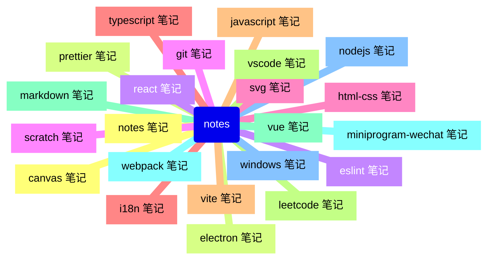

# notes

## 🔗 links

- https://tdahuyou.github.io/notes

## 📒 notes - 笔记管理架构

- 每一个节点都是一个 git 仓库，采用 notes 仓库来汇总笔记。

- **分仓库**：若所有笔记都统一丢到一个仓库中，后续仓库体积可能会变得异常庞大。
  - 仓库的划分可能有些是不太合理的，会根据实际情况不断调整优化。比如 markdown、mermaid 的笔记，从某种程度上讲，mermaid 的笔记其实可以一并丢到 markdown 中，因为 mermaid 的主要应用场景基本上都是在 markdown 中使用。
- **git log 问题**：随着 push 的数量增加，后续可能会导致仓库的历史记录变得很大，如果确实影响到了推拉的性能，会粗暴地将历史记录给丢弃，把仓库清掉，然后重新建一个同名的仓库，再把最新的内容推上去。
  - 或者研究研究重写 git log 的方案。

## 📒 notes - scripts 目录

- scripts 目录中存放笔记的一些批处理脚本。
  - `getTopInfos.js` 用于提取每篇笔记的头部信息。
    - 头部信息是指从第一行（不包括此行）也就是一级标题标题开始到第一个二级标题（不包括此行）为止的所有内容。将这些信息汇总到根目录下的 `TOP_INFOS.md` 文件中。
    - 头部信息中存放一些这篇笔记的元数据，比如：
      - 标题 `title`
      - 标签 `tags`
      - 摘要 `summary`
        - 以便快速了解这篇笔记的大致内容。
      - 待办 `todos`
      - ……
  - `setTopInfos.js` 用于批量更新每篇笔记的头部信息。
    - 使用 `getTopInfos.js` 脚本生成的 `TOP_INFOS.md` 是可以编辑的，这样可以在一个模块中批量更改所有笔记的头部信息。编辑完 `TOP_INFOS.md` 之后，执行 `setTopInfos.js` 脚本即可批量更新头部信息。
  - `renameTODO.js` 用于批量重命名待办事项。
    - 待办事项清单实际是根据知识点分组的笔记内容，针对某个知识点，往往对应多个笔记。在编写清单的时候，只需要按照指定格式写清楚知识点，然后加上笔记的编号即可。
    - 执行 `renameTODO.js` 会将笔记编号转为有效链接。
