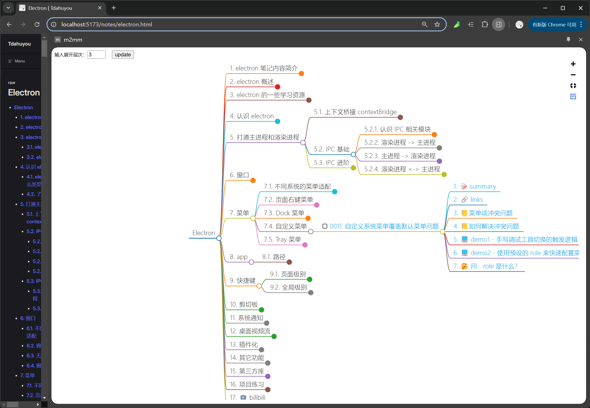
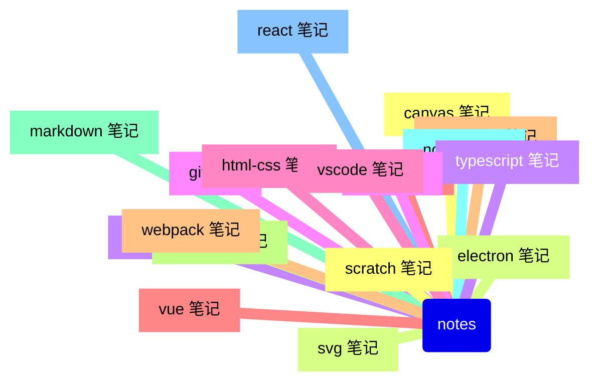
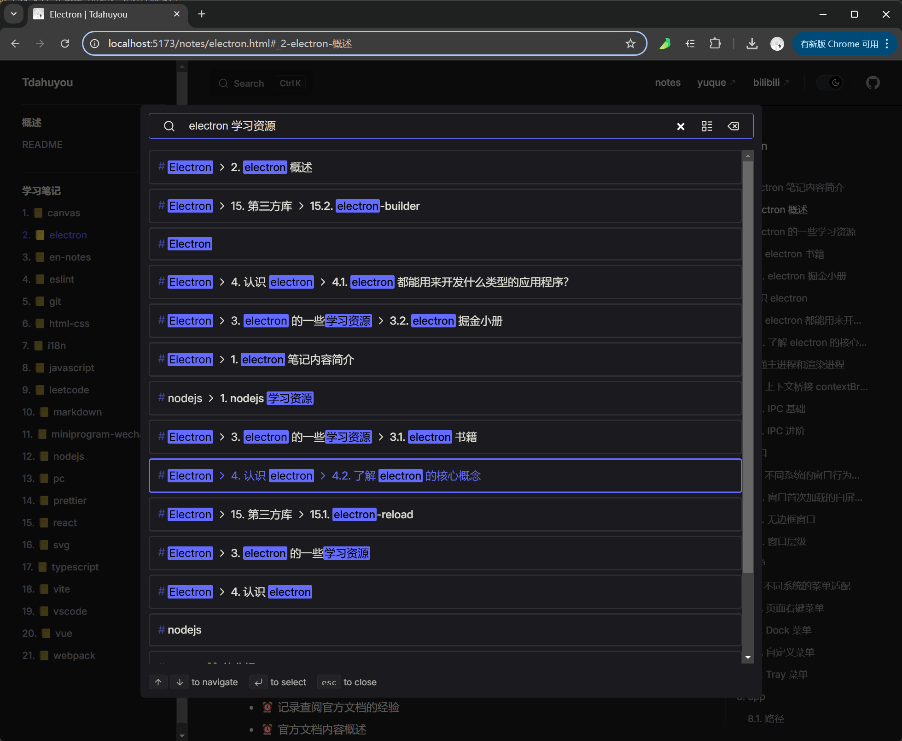

# TNotes 笔记概述


## ⏰ 待办

- **搬运早期笔记**：有时间就整理，目前（24.12）在搬运 yuque 上的早期笔记。

## 🔗 github

- https://github.com/Tdahuyou/notes
  - github
- https://tdahuyou.github.io/notes
  - github pages
- https://github.com/Tdahuyou/m2mm
  - m2mm 浏览器插件
  - This is a Chrome browser extension that converts Markdown content from the clipboard into a Markmap.

## 📒 页面结构


## 💻 结合 m2mm 浏览器插件 - 以思维导图的形式来呈现大纲



## 📒 笔记管理架构

- 每一个节点都是一个 git 仓库，采用 notes 仓库来汇总笔记。



- 笔记目录结构：

```bash
├── notes # 管理其他笔记
├── canvas
├── electron
├── en-notes
├── eslint
├── git
├── html-css
├── i18n
├── javascript
├── leetcode
├── markdown
├── miniprogram-wechat
├── nodejs
├── react
├── vue
├── vite
├── webpack
├── ……
```

- **分仓库**：若所有笔记都统一丢到一个仓库中，后续仓库体积可能会变得异常庞大。
  - 仓库的划分可能有些是不太合理的，会根据实际情况不断调整优化。比如 markdown、mermaid 的笔记，从某种程度上讲，mermaid 的笔记其实可以一并丢到 markdown 中，因为 mermaid 的主要应用场景基本上都是在 markdown 中使用。
- **git log 问题**：随着 push 的数量增加，后续可能会导致仓库的历史记录变得很大，如果确实影响到了推拉的性能，会粗暴地将历史记录给丢弃，把仓库清掉，然后重新建一个同名的仓库，再把最新的内容推上去。
  - 或者研究研究重写 git log 的方案。
- **大型静态资源问题**：主要是一些 pdf 书籍、视频等，这些内容暂时采用语雀知识库来存储，通过笔记编号可以快速定位到相应的资源即可。

## 📒 scripts 目录内容说明

- scripts 目录中存放笔记的一些批处理脚本。
  - `scripts/updateREADME.js` 暴露一个 ReadmeUpdater 类，根据传入的 repoName 更新 home README.md 和每篇笔记的 README.md，对应笔记仓库中的 `npm run update` 命令。
  - `scripts/notes-merge-distribute.js` 暴露两个函数：mergeReadme、distributeReadme，分别负责收集笔记和分发笔记，对应笔记仓库中的 `npm run merge`、`npm run distribute` 命令。
  - `scripts/utils.js` 中的 `syncLocalAndRemote` 方法，根据传入的 repoName，完成本地和远程仓库的内容同步。
- 为了更方便地在笔记中使用上述脚本的功能，可以在当前的 notes 目录中执行 `npm link` 形成软链接，然后在每个笔记仓库中执行一遍 `npm link tnotes`，相当于在每个笔记仓库中安装了上述脚本。

## 💻 以 javascript 笔记管理流程为例

- 是先准备好俩文件 `javascript/package.json`。
- 下面是 javascript/package.json 中的内容，主要存放一些脚本。
  - 其中 merge、distribute 通常在初期处理格式问题的时候才需要用到。

```json
{
  "scripts": {
    "merge": "      node ./node_modules/tnotes   --mergeREADME         --repoName=javascript",
    "update": "     node ./node_modules/tnotes   --updateREADME        --repoName=javascript",
    "distribute": " node ./node_modules/tnotes   --distributeREADME    --repoName=javascript",
    "sync": "       node ./node_modules/tnotes   --syncREADME          --repoName=javascript"
  },
  "tnotesConfig": {
    "ignoreDirs": [
      "0000",
      ".git",
      ".vscode",
      "9999. template"
    ]
  }
}
```
- 命令作用简介：
  - `npm run merge`
    - 将所有笔记 `javascript/****` 合并到 `javascript/MERGED_README.md` 文件中，所有内容合并到一个文件中方便快速地查找替换，主要用于处理一些格式上的问题，以免在多个文件中反复切换。
  - `npm run distribute`
    - 和 merge 对应，merge 命令负责收集笔记，distribute 负责在修改完收集的笔记内容后，将修改后的内容下发到每一篇笔记。
  - `npm run update`
    - 更新 README 文件，包括首页的 README.md 和每个笔记的 README.md。主要处理每篇笔记的目录结构，并将笔记的目录信息提取到 home README 中，形成一个有效的目录结构。
  - `npm run sync`
    - 保持本地和 GitHub 远程仓库内容同步，相当于执行了 `git pull`、`git add .`、`git commit -m "update"`、`git push`。
- tnotesConfig 配置中的内容是 tnotes 脚本的配置数据。
  - ignoreDirs，用于配置忽略一些不需要处理的目录。

## 📒 emoji 规范

- ⏰
  - 闹钟
  - 表示待办事项。
- 📝
  - 记录
  - summary
  - 概述
  - 表示总结性的一些描述信息。
- 💻
  - 电脑
  - demo
  - 表示示例。
- 📒
  - 笔记
  - notes
  - 表示笔记。
- ⚙️
  - 齿轮
  - 表示模块中的组成部分，工程由一个个小齿轮组成，比如：
    - 函数
    - 变量
    - 属性
    - 成员
- 🔍
  - 放大镜
  - 搜索
  - 表示查看源码，或者查看某篇 具体的 文章等。
- 🔗
  - 链接
  - 表示链接的集合，一篇笔记中的所有链接都汇总到 🔗 中。
- 🤖
  - 机器人
  - 表示 AI 回复。

## 🤔 Q&A

### 问：这个站点中记录的内容是什么？

1. **笔记目录**：在目录中，对笔记内容做了简单的分组归类，可以根据需要选择性阅读，**不建议按照编号顺序来阅读**。其中打勾的 `- [x]` 表示已完成的笔记，未打勾的 `- [ ]` 表示未完成的笔记。
2. **全局信息**：全局性质的信息丢在这个站点里边统一处理，这样不用在每个笔记仓库中都写一遍。

### 问：为什么不使用云笔记来管理内容？

- **纯 markdown 的形式更高效**：实践证明在使用纯 markdown 的形式来整理笔记比使用云笔记的效率更高，因此选择放弃云笔记。
- **大量笔记不卡顿**：在使用 yuque 的时候，当某一篇笔记的内容破 w 字之后，会感觉到明显的卡顿。而在本地编写 .md 的话，基本无感。
- **数据可自由管理**：因为会点儿编程，如果笔记数据存储在本地，可以自个儿写脚本来读写笔记内容，然后做一系列处理。比如：
  - 读取笔记内容，使用 markmap 快速生成思维导图；自行构建笔记目录；
  - 自动提取某个笔记仓库中每篇笔记的头部信息（笔记目录，以及笔记的概述），汇总到根 README 中，以便快速查阅；（笔记当前站点中存放的笔记目录，就是这么提取出来的。）
  - ……

### 问：如何快速地查询笔记？

- 在查询的时候，先输入笔记仓库关键字，比如要查 electron 的相关笔记，那就先输入 `electron`，然后加一个空格 ` `，再跟上查询关键字，这样测试下来的查询效果会略好一些。
  - 
- doc: https://vitepress.dev/zh/reference/default-theme-search#local-search
  - 这是 vitepress 提供的本地搜索的功能描述，其实现原理是基于 [minisearch](https://github.com/lucaong/minisearch/) 来做的。

### 问：现在写这些内容的目的是？
  
- **可以帮助自己思考如何搭建个人的笔记架构。**