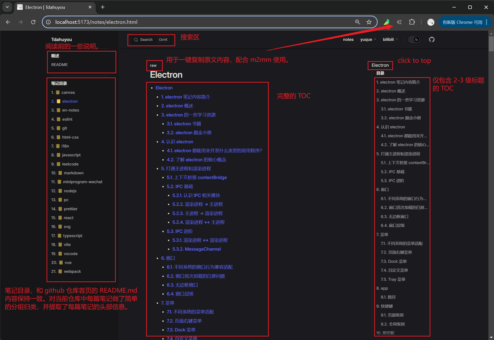

# TNotes 笔记概述

该站点是基于 github pages 和 vitepress 搭建的个人博客，目前主要存储一些个人的学习笔记。正在逐步将 yuque 上的笔记搬运到 github 上。

> - 大二（2019.06.14）去学校附近的海边拍的脚印。

## 📒 TNotes 简介

- TNotes 是一个基于 VitePress 和 Github Pages 搭建的个人笔记平台。
- 汇总了个人写的一些笔记内容大纲，以便查阅、分享。笔记已开源在 github 上，有需要的可自行 clone。
- 除了学习笔记之外，也会考虑记录一些其他软七八糟的内容，比如随笔、做饭、日常、阅读过的书籍、自己写的一些开源项目，等等。

## 📒 页面结构

> - 笔记完整的目录请到 github 中查看。（注：锚点在 github 上有效，在 vitepress 生成的文档中无效）
