# 🗓 2022

## 🗓 12-22

<MyDynamicComp>
  <template #text-area>
    
冬至

    
早 5:55 的闹钟 ⏰ 响了

    
从闹钟的语音播报中得知今日最低气温零下 3 度

    
极不情愿地穿好衣服

    
离开被窝

    
拿起手机

    
随后上叮咚买菜抢菜

    

    
进入订单页面

    
睡眼朦胧地疯狂点击结算按钮

    
猛戳 5 分钟后

    
收到短信提示银行卡扣款成功

    
大喜

    
原来真有希望钱被花出去的时候

    

    
一年前

    
也就有幸在新闻上看到他人这番举动

    
不免觉其好惨

    
一年后的今天

    
好惨成员➕1

    

    
经验总结

    
下次抢

    
记得睡前把手机放床头......

  </template>
  <template #time>2022-12-22 06:42</template>
</MyDynamicComp>

## 🗓 11-30

<MyDynamicComp>
  <template #text-area>
    
顶不住了

    
顶不住了

  </template>
  <template #image-list="{ openModal }">
    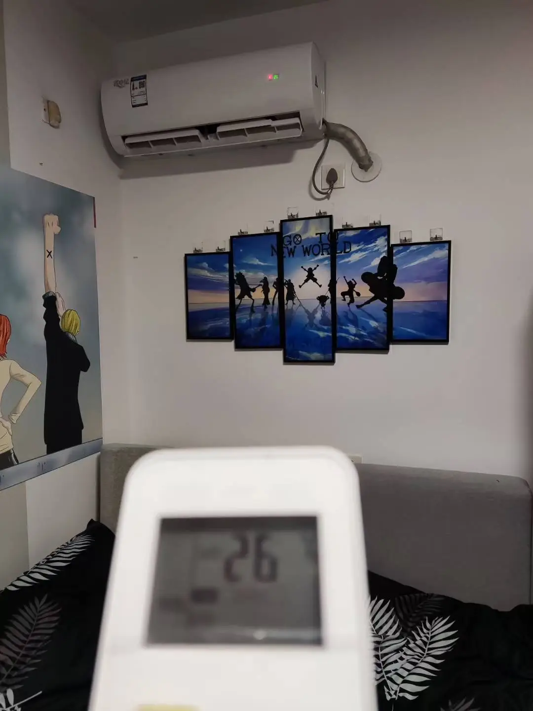
  </template>
  <template #time>2022-11-30 19:02</template>
</MyDynamicComp>

## 🗓 11-11

<MyDynamicComp>
  <template #text-area>
    
10月

    
py：工作多久啦？

    
w：有仨月了叭！

    
py：有啥收获嘛？

    
w：胖了五公斤算不算~

    

    
PS：十月夜跑 81 圈（800m/圈），才减一公斤 😅😅😅

  </template>
  <template #image-list="{ openModal }">
    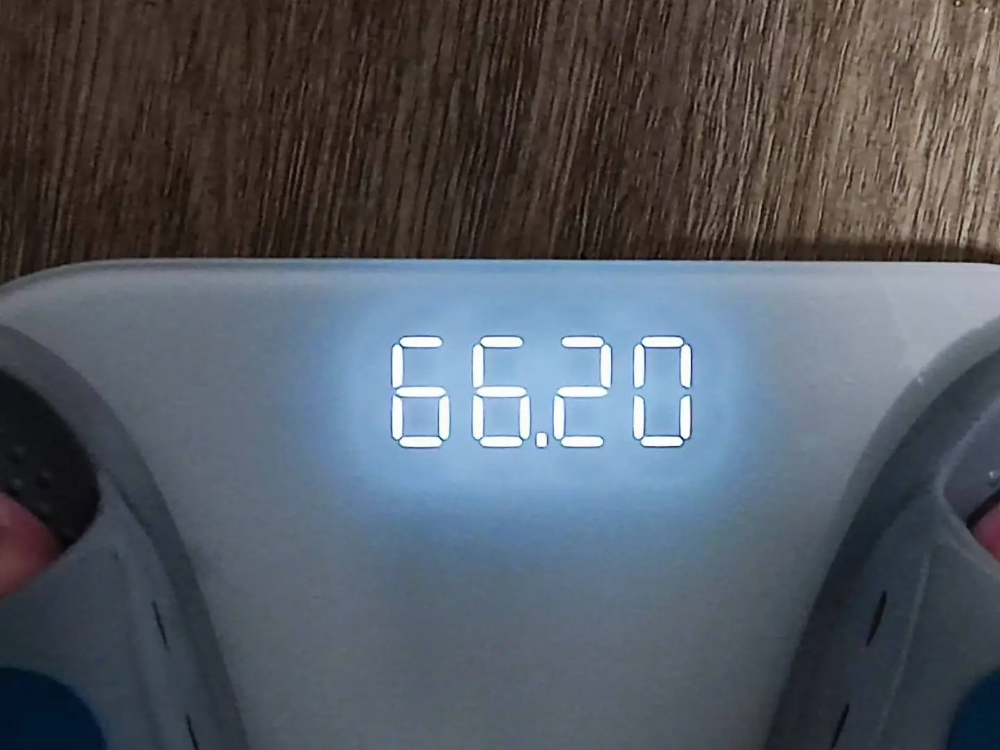
    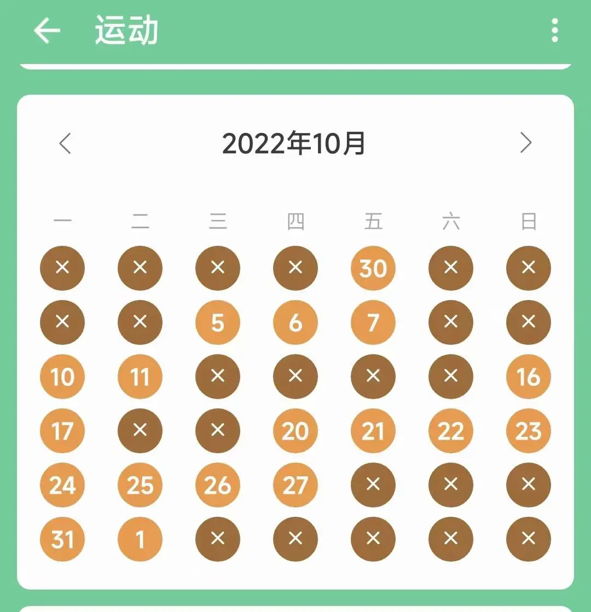
    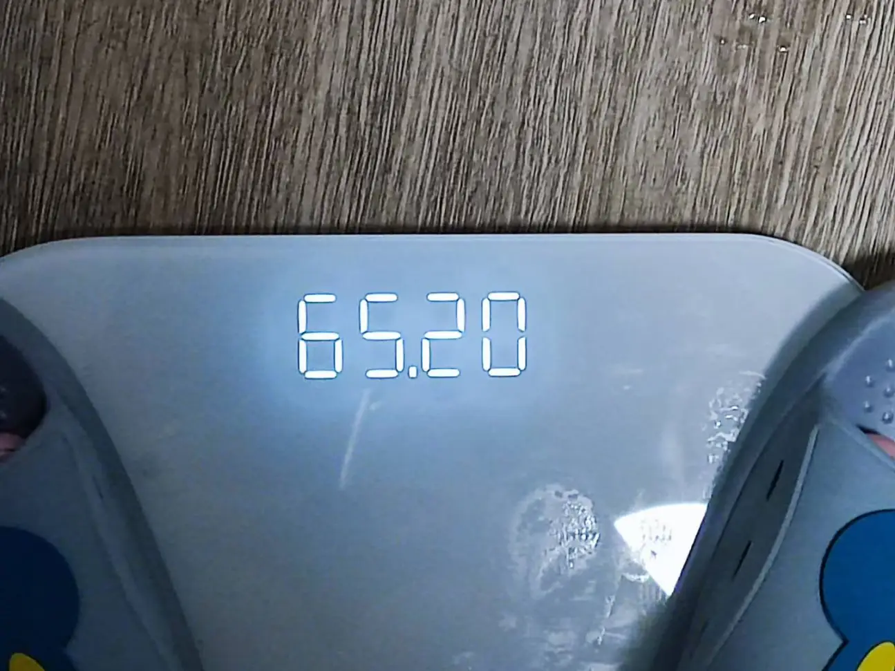
  </template>
  <template #time>2022-11-11 22:36</template>
</MyDynamicComp>

## 🗓 09-15

<MyDynamicComp>
  <template #text-area>
    
台风：快醒醒，快醒醒，你忘带耳塞了~~

    
我：对！对！对！

  </template>
  <template #image-list="{ openModal }">
    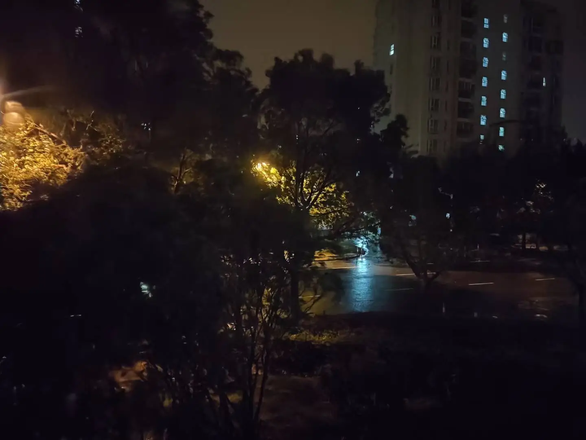
  </template>
  <template #time>2022-09-15 02:14</template>
</MyDynamicComp>

## 🗓 09-02

<MyDynamicComp>
  <template #text-area>
    
连株薄荷都养不活 😭😭😭

    

    
最后再抢救一下吧，希望我这神仙操作不是加速了你的死亡

  </template>
  <template #image-list="{ openModal }">
    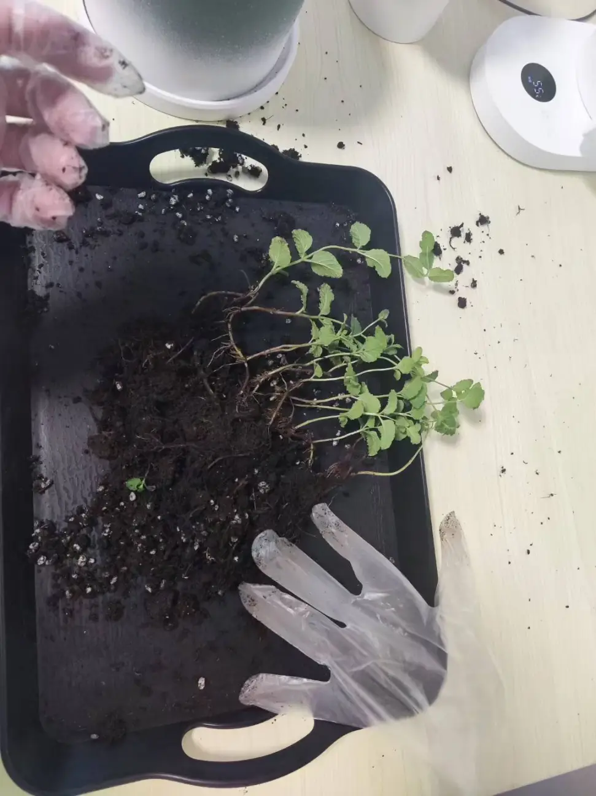
    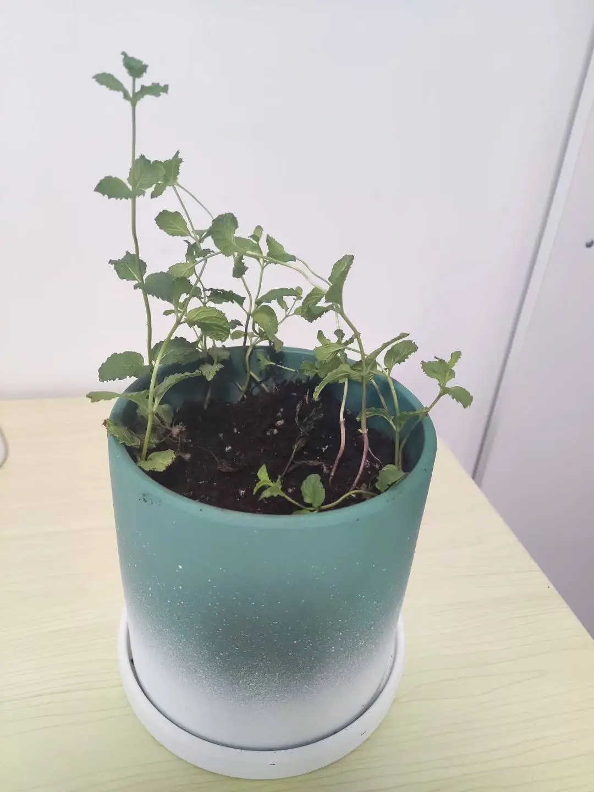
  </template>
  <template #time>2022-09-02 09:25</template>
</MyDynamicComp>

## 🗓 07-22

<MyDynamicComp>
  <template #text-area>
    
煮面记

    
煮面时：熟了吗？熟了吗？熟了吗？？？别溢锅。别溢锅。别溢锅。。。

    
煮完面：诶，卖相正常

    
吃面时：... 生而为人，我很抱歉

  </template>
  <template #image-list="{ openModal }">
    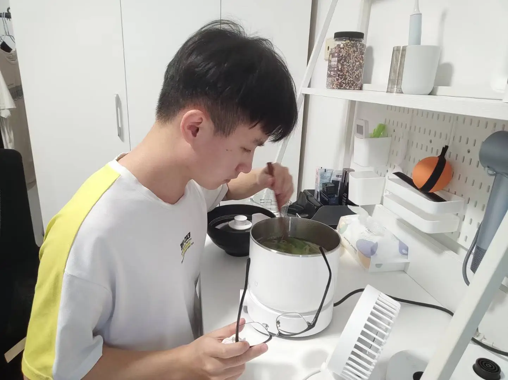
    
    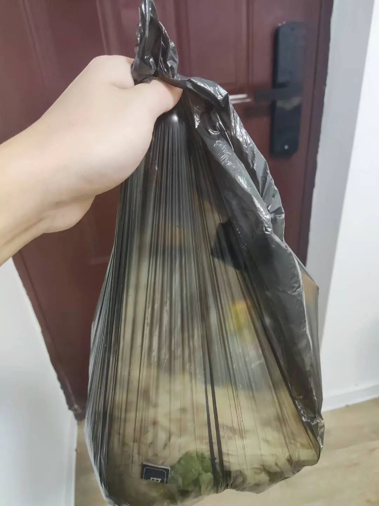
  </template>
  <template #time>2022-07-22 08:13</template>
</MyDynamicComp>

## 🗓 07-10

<MyDynamicComp>
  <template #text-area>
    
做菜日常翻车，有点意思！！！记录一下

    

    
不清楚附近菜的价格，便上超市把所有菜的价格牌都拍了一波

    
一斤大概多重？图二那么大的鸡中翅，10个差不多就是一斤

    
第一次炸鸡中翅，先取俩来测试，简单水洗后，给它们身上来上俩刀，留下爱的痕迹，就直接丢锅走起。出炉后，有幸被吃上一口，随后🗑️便是它们的归宿。

    
上网一查，哦~ 原来这玩意儿需要腌制一下！！！又挑选仨，按照教程操作完之后，关冰箱禁闭半小时

    
等待过程中，上第二道菜，炸红薯🍠，好在它做起来比较简单，洗个澡直接入锅。谁曾想这果子都开始出来骗了，明明那么红，熟了之后才知道自己炸的这是紫薯。简单吃了一些，它就和前边那俩位团聚去了。唉，空有一副好看的皮囊，又有何用，还不是...

    
两次翻车，打击颇深，想着要不来一份妹妹都会做的 - 煮馄饨！感觉这操作很简单

    
烧水

    
取出馄饨放边上等着

    
手机开始查教程

    
本想查“煮馄饨需要多久”，结果输入“煮馄饨”三个字的时候，立刻弹出“煮馄饨需要冷水下锅嘛”

    
心想，不好，水已在烧，这次怕不是又要翻车，看完文章后，哈，虚惊一场，虚惊一场正好，水烧开了，打开混沌包装，打算一口气全部倒下去，好让它们一起下锅，之后一起捞起，就不会有的熟了有的没熟了，便给它们来了个180°大反转...

    
结果，这些哥，因为太早被取出来，和底盘黏在一起了，这反转，来得是有些突然哈...

    
然后就是，三个馄饨下锅，其它混沌继续丢冰箱，真就煮了个寂寞...

    
车嘛，就是用来翻的。俗话说，智者千虑，必有一失；愚者千虑，必有一得。之前关禁闭的鸡翅，这下终于排上用场了，大老爷们儿多少还是要点脸的哈，多多少少找回点面子。好在成品卖相还行，味道嘛，能吃，能吃

    
最后，还是不捣腾了，把公区厨房搞得乌烟瘴气，室友得提刀来见了。这就是我今晚吃烧烤的理由。

  </template>
  <template #image-list="{ openModal }">
    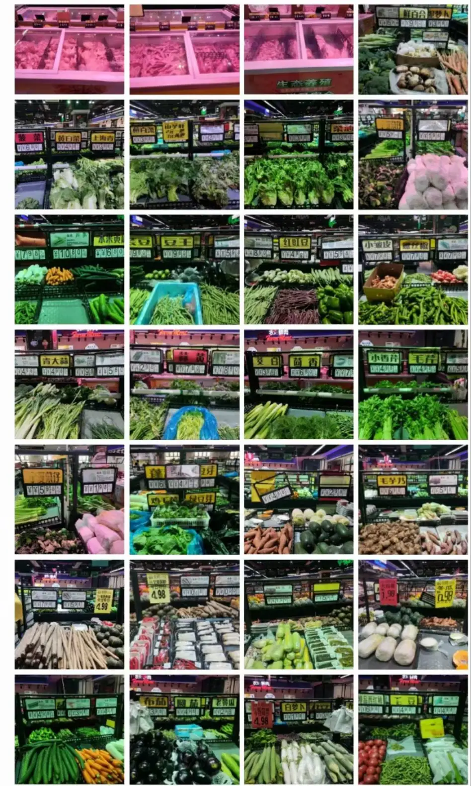
    
    
    
    
    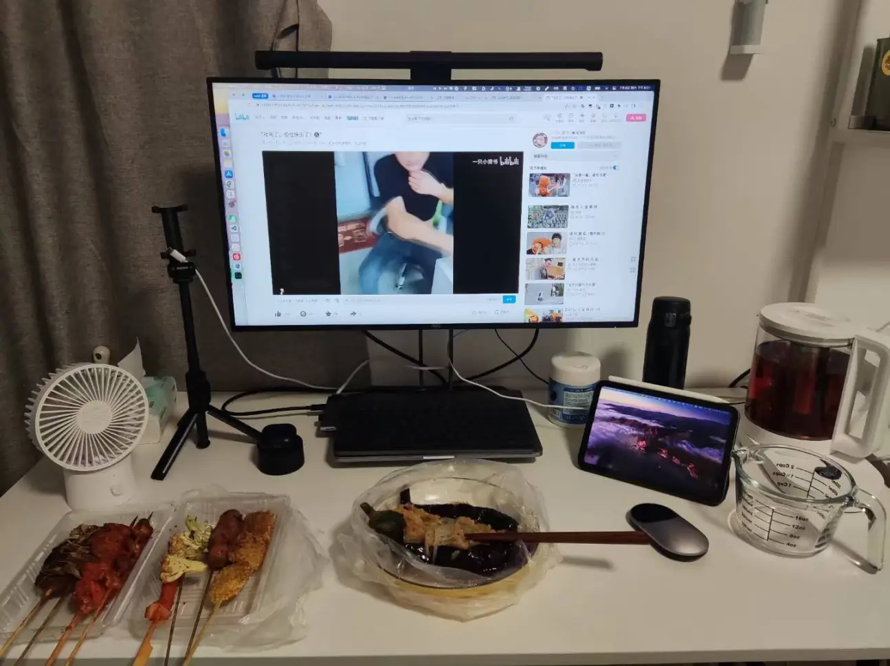
  </template>
  <template #time>2022-07-10 12:25</template>
</MyDynamicComp>

## 🗓 06-23

<MyDynamicComp>
  <template #text-area>
    
本只想要三个，搁的时候掉下来八个。。。

  </template>
  <template #image-list="{ openModal }">
    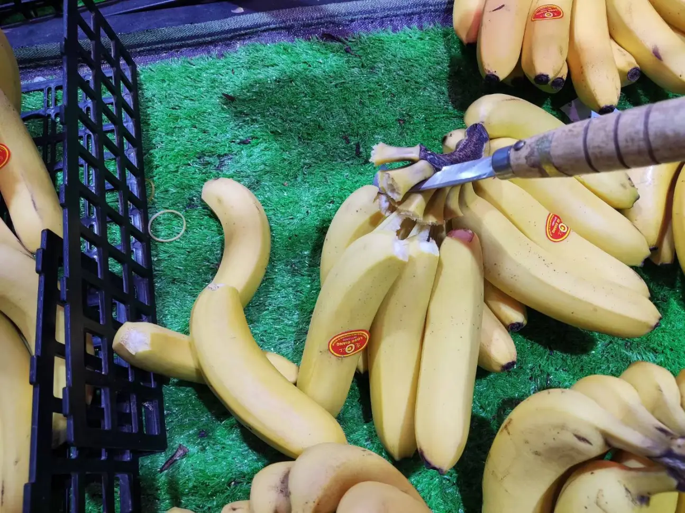
    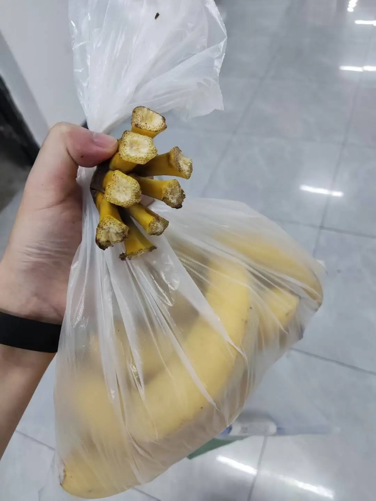
  </template>
  <template #time>2022-06-23 21:11</template>
</MyDynamicComp>

## 🗓 06-19

<MyDynamicComp>
  <template #text-area>
    
动身前

    
有幸还有机会能和大帅哥骑行去看一次海

    
毕业当程序员去啦，这是开始时候的发际线。几年后再拍，应该就不需要用手把头发往上撩叭！！！

  </template>
  <template #image-list="{ openModal }">
    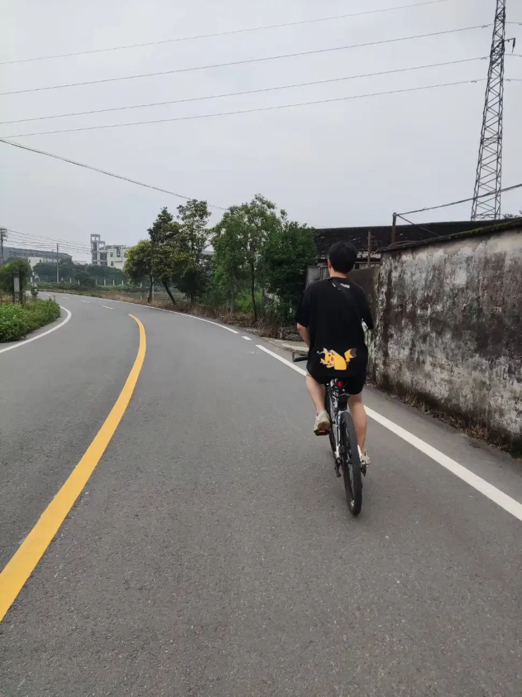
    
    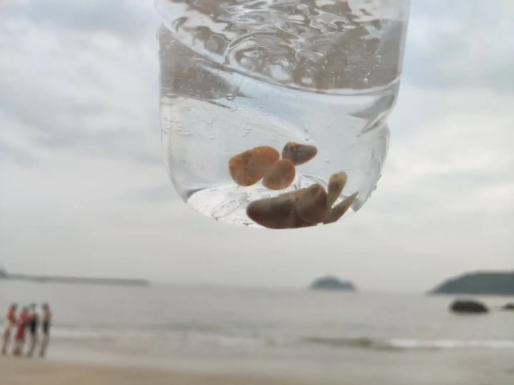
    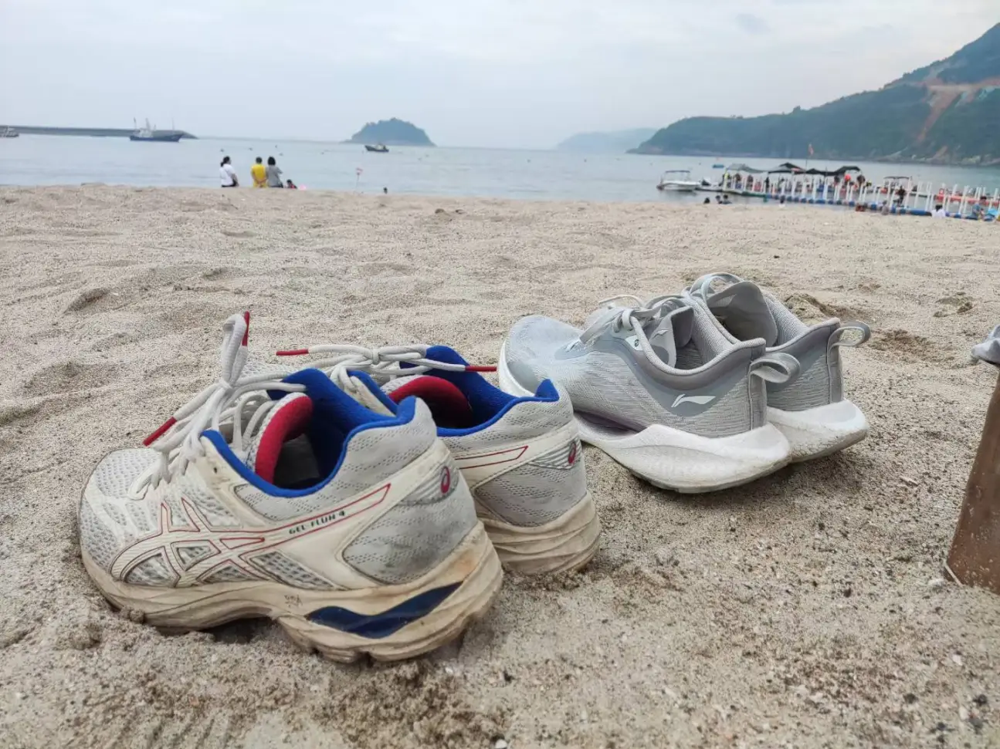
    
    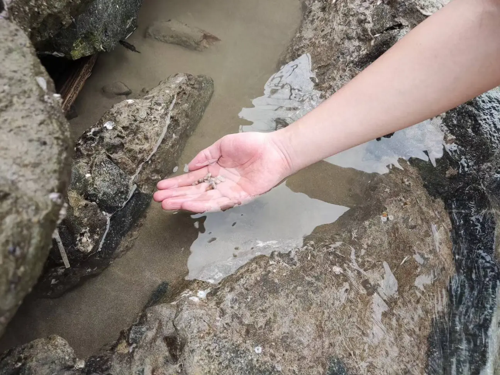
  </template>
  <template #time>2022-06-19 15:56</template>
</MyDynamicComp>

## 🗓 06-16

<MyDynamicComp>
  <template #text-area>
    
愿妹妹蒙的全对~~~

    

    
七年前是你哥在里边，运气还不错，很幸运，成绩比预期的好很多。

    

    
如果这次你考砸了，肯定不是你哥把运气用光了。

  </template>
  <template #image-list="{ openModal }">
    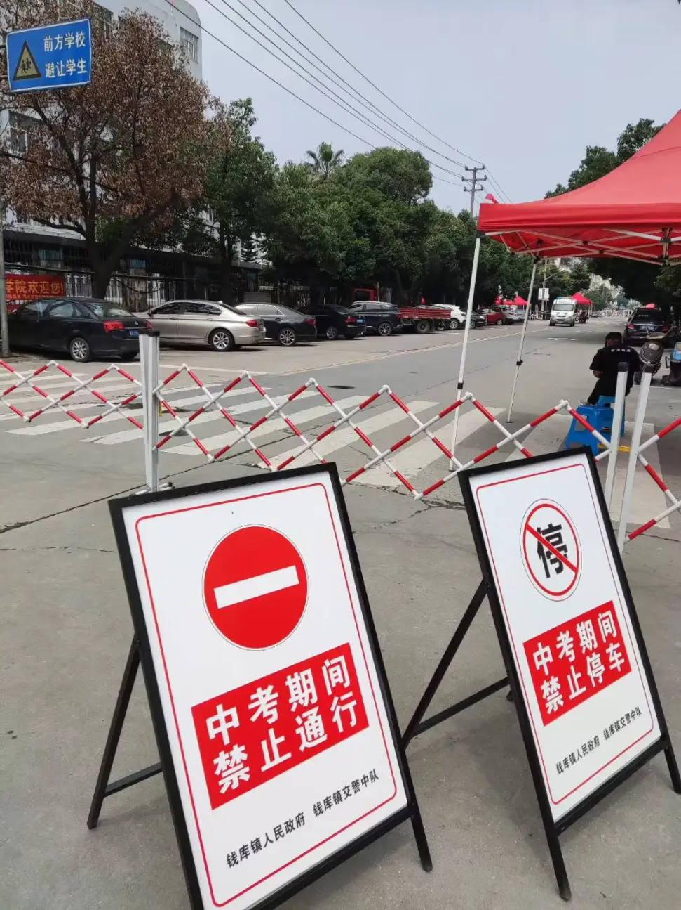
    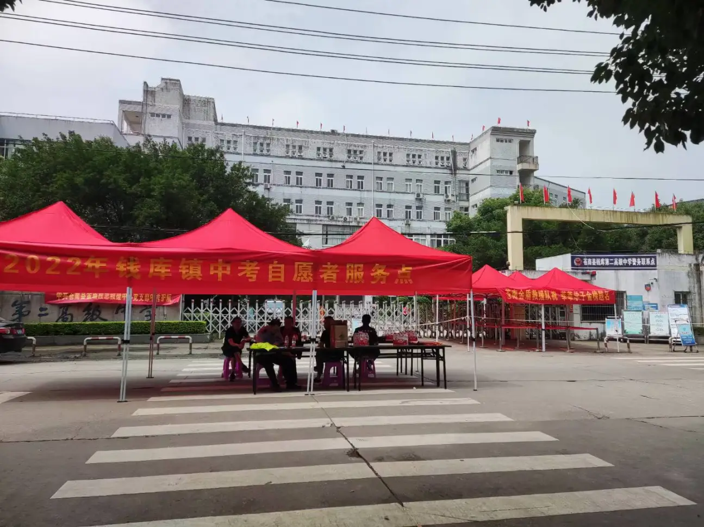
  </template>
  <template #time>2022-06-16 10:19</template>
</MyDynamicComp>

## 🗓 06-06

<MyDynamicComp>
  <template #text-area>
    
隔离区新福利：🎶

    

    
声音很治愈，雨声、鸟鸣声、地上的流水声，铁皮和雨滴的碰撞声。。。

    
想分享，但设备不争气 😭😭😭

    

    
录制时间：66

    
录制地点：1006号监狱

    
录制效果：听个响 🤣

    

    
在上次的新闻周刊中，认识到李星宇，一位声音工程师，录制大自然的声音，并分享。听到这职业，第一反应，挖槽，真酷。随后上网易云，果然搜到了一些乐队的作品，单是看曲名就觉得很酷，很是喜欢。随便打开了几首，随后就都进歌单。😄😄😄

  </template>
  <template #time>2022-06-06 05:59</template>
</MyDynamicComp>

> ⏰ TODO
> - 上传视频到 B 站

## 🗓 06-03

<MyDynamicComp>
  <template #text-area>
    
😭😭 想吃粽子

  </template>
    <template #image-list="{ openModal }">
    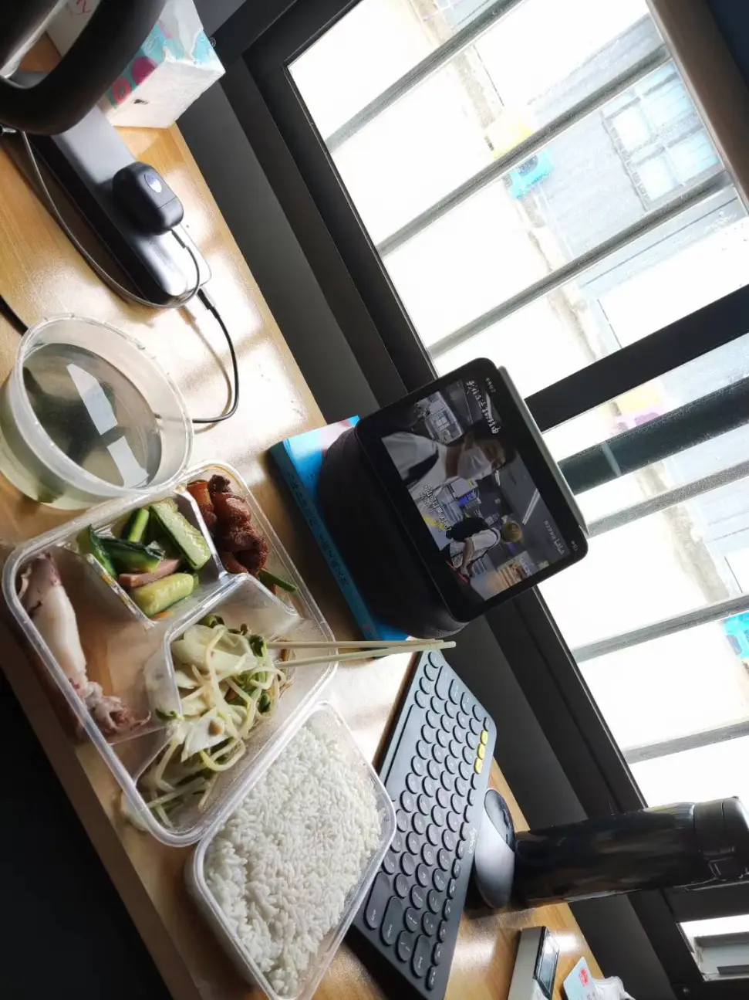
    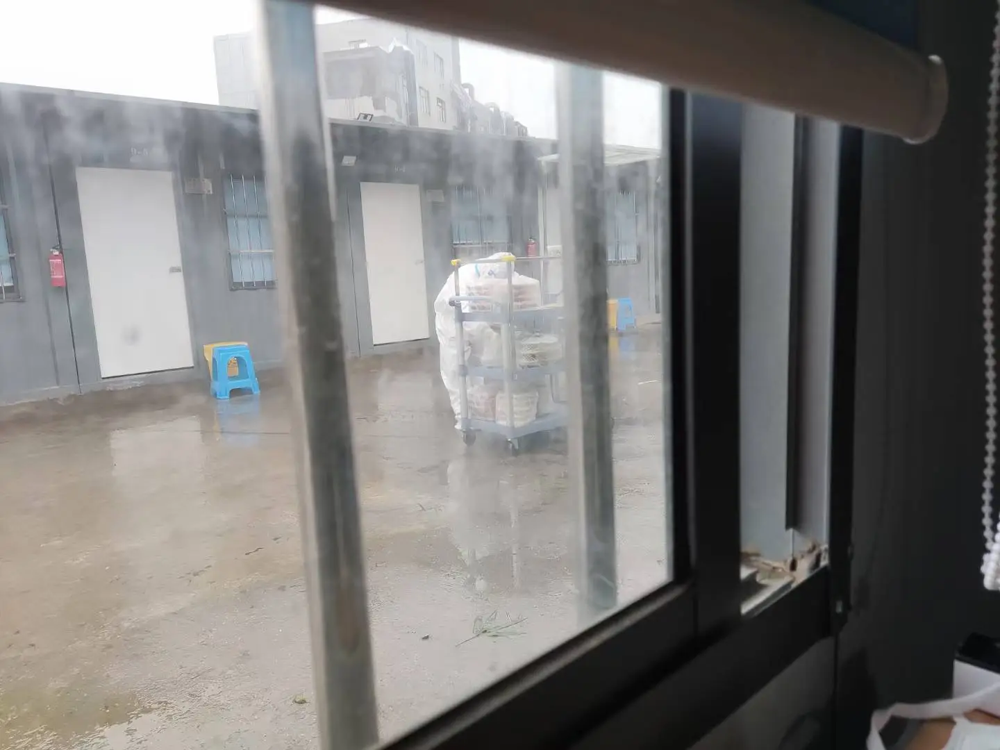
  </template>
  <template #time>2022-06-03 10:30</template>
</MyDynamicComp>

## 🗓 05-31

<MyDynamicComp>
  <template #text-area>
    
明儿一早就离校啦

    
今儿已是最后一晚

    

    
整理个人物品，没想到翻到了四年前的一封家书，然后立刻去找爸妈，结果老妈还真找到了我入学时写给他们的信。

  </template>
    <template #image-list="{ openModal }">
    
    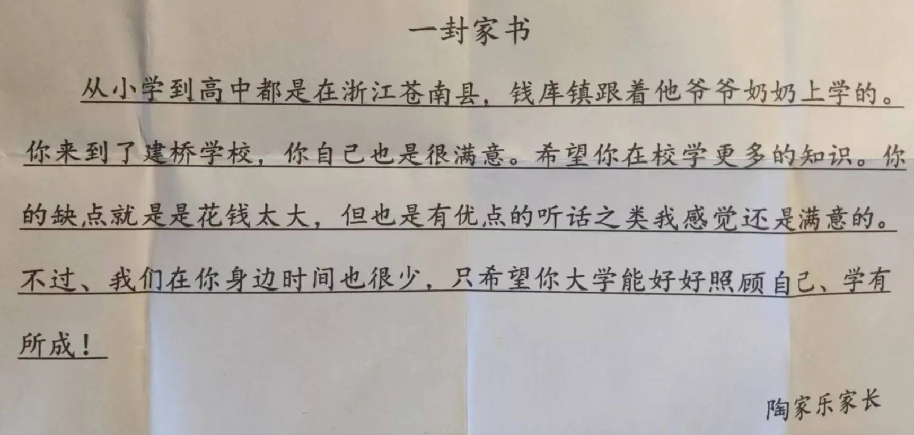
    
  </template>
  <template #time>2022-05-31 22:10</template>
</MyDynamicComp>

## 🗓 05-25
## 🗓 03-14
## 🗓 02-12
## 🗓 02-05
## 🗓 02-04
## 🗓 01-31
## 🗓 01-29
## 🗓 01-25
