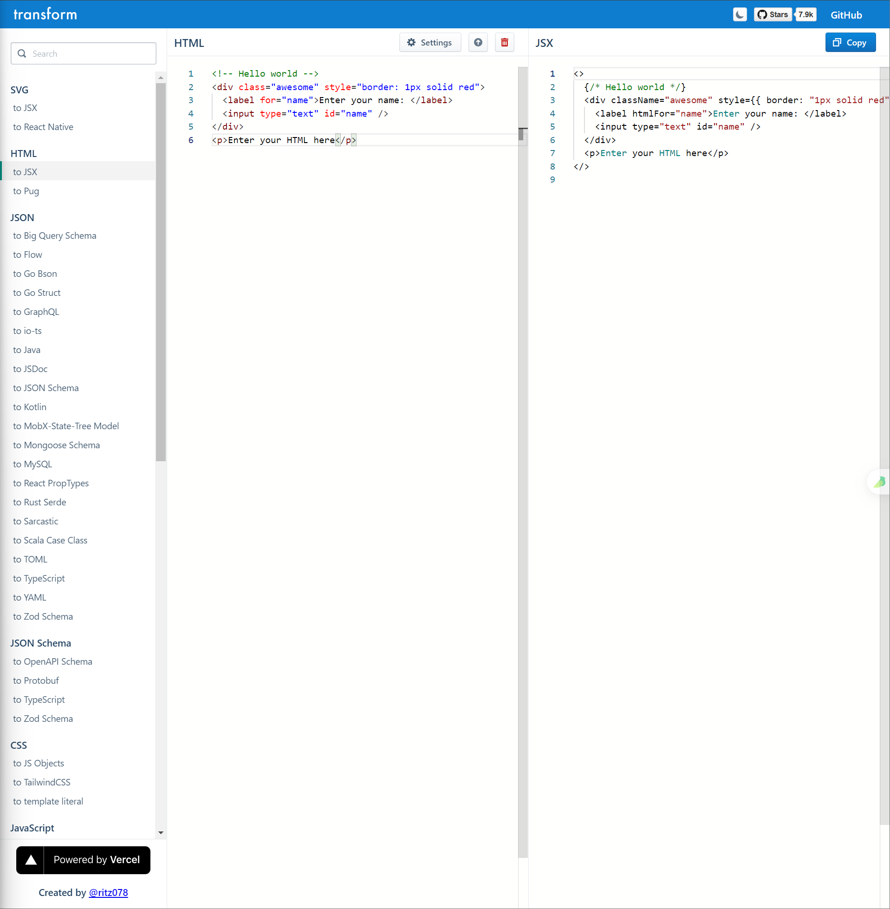

# [0003. html to jsx 在线转换](https://github.com/Tdahuyou/react/tree/main/0003.%20html%20to%20jsx%20%E5%9C%A8%E7%BA%BF%E8%BD%AC%E6%8D%A2)

<!-- region:toc -->
- [1. 🔗 transform - html 转 jsx 在线转换器](#1--transform---html-转-jsx-在线转换器)
- [2. 💻 一个简单的 html to jsx 转换示例](#2--一个简单的-html-to-jsx-转换示例)
<!-- endregion:toc -->
- 如果你有大量的 HTML 需要移植到 JSX 中，你可以使用 [transform 在线转换器](https://transform.tools/html-to-jsx) 来实现快速转换，参考转换后的结果来编写你的 JSX 模板。

## 1. 🔗 transform - html 转 jsx 在线转换器

- https://transform.tools/html-to-jsx
  - html 转 jsx 在线转换器。
  - 
- https://github.com/ritz078/transform
  - transform GitHub 仓库。

## 2. 💻 一个简单的 html to jsx 转换示例

::: code-group

```html [转换前的 html]
<!-- Hello world -->
<div class="awesome" style="border: 1px solid red">
  <label for="name">Enter your name: </label>
  <input type="text" id="name" />
</div>
<p>Enter your HTML here</p>
```


```js [转换后得到的 jsx]
<>
  {/* Hello world */}
  <div className="awesome" style={{ border: "1px solid red" }}>
    <label htmlFor="name">Enter your name: </label>
    <input type="text" id="name" />
  </div>
  <p>Enter your HTML here</p>
</>
```

:::