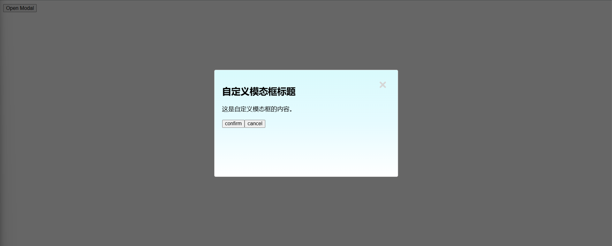

# [0006. react-modal](https://github.com/Tdahuyou/react/tree/main/0006.%20react-modal)

<!-- region:toc -->
- [1. 💻 demos.1 - 认识 contentLabel 属性](#1--demos1---认识-contentlabel-属性)
- [2. 💻 demos.2 - 封装一个简单的 dialog 组件](#2--demos2---封装一个简单的-dialog-组件)
<!-- endregion:toc -->
- `react-modal` 是一个常用的 React 弹出模态框库，它提供了许多配置选项来定制模态框的行为和样式。
- `react-modal` 使用起来非常简单的一个第三方组件，结合官方文档描述来使用即可。
- 笔记中记录了一些 `react-modal` 的基本使用示例，以及在使用这个组件时比较模糊的一些点，比如 contentLabel 属性（是用来做特殊用户的阅读体验优化的）。
- react-modal 相关链接
  - https://www.npmjs.com/package/react-modal?activeTab=readme - npm react-modal
  - https://github.com/reactjs/react-modal - github react-modal

## 1. 💻 demos.1 - 认识 contentLabel 属性

`contentLabel` 用于给模态框添加一个可访问性的标签（aria-label），以便屏幕阅读器和其他辅助技术能够更好地理解和描述模态框的内容。
  1. **可访问性（Accessibility）**：`contentLabel` 用于为模态框添加一个描述性的标签，这个标签会被屏幕阅读器读取，帮助视障用户理解模态框的内容。这对于提高应用的可访问性非常重要。
  2. **ARIA 标签**：在 HTML 中，`aria-labelledby` 和 `aria-label` 属性用于提供额外的信息，帮助辅助技术（如屏幕阅读器）更好地理解和描述页面上的元素。`contentLabel` 会在模态框的 `role="dialog"` 元素上设置 `aria-label` 属性。
- 为什么 `contentLabel` 很重要
  1. **辅助技术兼容性**：`contentLabel` 使得模态框更加兼容辅助技术，如屏幕阅读器。
  2. **用户体验**：对于依赖屏幕阅读器的用户来说，清晰的标签可以提高用户体验。
  3. **合规性**：遵循无障碍设计的最佳实践，确保你的应用符合 WCAG（Web Content Accessibility Guidelines）的要求。
- 下面是一个使用 react-modal 的简单示例：

```jsx
import React from 'react';
import Modal from 'react-modal';

Modal.setAppElement('#root'); // 设置应用根元素

const App = () => {
  const [modalIsOpen, setIsOpen] = React.useState(false);

  function openModal() {
    setIsOpen(true);
  }

  function closeModal() {
    setIsOpen(false);
  }

  return (
    <div>
      <button onClick={openModal}>Open Modal</button>
      <Modal isOpen={modalIsOpen} onRequestClose={closeModal} contentLabel="Example modal dialog">
        <h2>模态框标题</h2>
        <p>这是模态框的内容。</p>
        <button onClick={closeModal}>关闭模态框</button>
      </Modal>
    </div>
  );
};

export default App;
```

- 在这个的示例中：
  - `contentLabel="Example modal dialog"` 为模态框提供了一个描述性的标签，告诉屏幕阅读器这是一个“示例模态对话框”。
  - 当模态框打开时，屏幕阅读器会读取这个描述性的标签，帮助视障用户理解模态框的作用。
  - `Modal.setAppElement('#root')` 设置了应用的根元素，这对于确保模态框的正确渲染和可访问性非常重要。

## 2. 💻 demos.2 - 封装一个简单的 dialog 组件

- 视口居中。
- 宽高可自定义。
- 内容区域可自定义。
- 关闭按钮可配置是否显示。
- 内容区域背景渐变。

```jsx
import React from "react";
import Modal from "react-modal";
import iconCloseBtn from "./icon--close-btn.svg";

Modal.setAppElement("#root"); // 设置应用根元素

const MyModal = ({ isOpen, onRequestClose, width = "480px", height = "280px", children, showCloseButton = true }) => {
  const customStyles = {
    content: {
      width,
      height,
      // 居中
      top: "50%",
      left: "50%",
      right: "auto",
      bottom: "auto",
      marginRight: "-50%",
      transform: "translate(-50%, -50%)",
      // 渐变背景
      background: "linear-gradient(to bottom, #D9FAFC, #E6FBFF, #FFFFFF)",
      // 添加相对定位以便子元素绝对定位
      position: "relative",
      // 确保内边距和边框包含在宽度和高度内
      boxSizing: "border-box",
    },
    overlay: {
      backgroundColor: "rgba(0, 0, 0, 0.6)",
    },
  };

  return (
    <Modal
      isOpen={isOpen}
      onRequestClose={onRequestClose}
      style={customStyles}
      contentLabel="Custom Modal"
    >
      {showCloseButton && (
        
      )}
      {children}
    </Modal>
  );
};

const App = () => {
  const [modalIsOpen, setIsOpen] = React.useState(false);

  function openModal() {
    setIsOpen(true);
  }

  function closeModal() {
    setIsOpen(false);
  }

  function handleCancel() {
    console.log('cancel');
    closeModal();
  }

  function handleConfirm() {
    console.log('confirm');
    closeModal();
  }

  return (
    <div>
      <button onClick={openModal}>Open Modal</button>
      <MyModal
        isOpen={modalIsOpen}
        onRequestClose={handleCancel}
      >
        <h2>自定义模态框标题</h2>
        <p>这是自定义模态框的内容。</p>
        <button onClick={handleConfirm}>confirm</button>
        <button onClick={handleCancel}>cancel</button>
      </MyModal>
    </div>
  );
};

export default App;
```

- 

