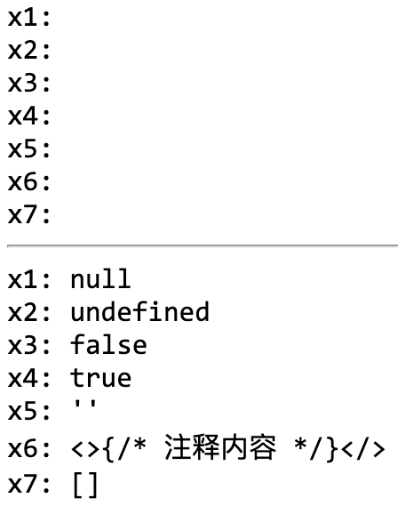
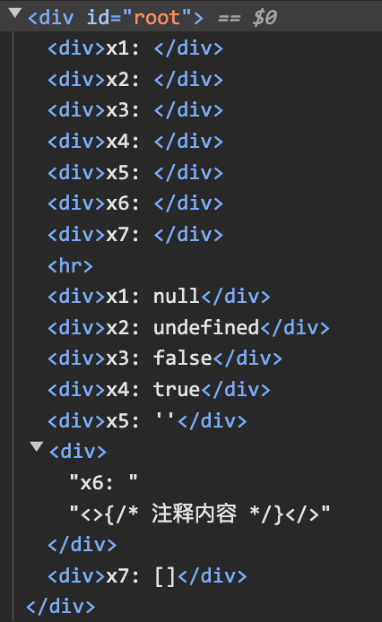
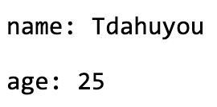
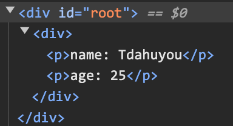

# [0009. 在 JSX 中使用 JS 表达式](https://github.com/Tdahuyou/react/tree/main/0009.%20%E5%9C%A8%20JSX%20%E4%B8%AD%E4%BD%BF%E7%94%A8%20JS%20%E8%A1%A8%E8%BE%BE%E5%BC%8F)

<!-- region:toc -->
- [1. 📒 在 JSX 中使用 JS 表达式](#1--在-jsx-中使用-js-表达式)
- [2. 💻 demos.1 - 完整示例](#2--demos1---完整示例)
- [3. 🔍 扩展 - Hedy Lamarr 是谁？](#3--扩展---hedy-lamarr-是谁)
- [4. 💻 demos.2 - 在表达式中无法渲染的一些特殊值](#4--demos2---在表达式中无法渲染的一些特殊值)
- [5. 💻 demos.3 - 无法渲染普通对象，可以渲染 react 元素对象](#5--demos3---无法渲染普通对象可以渲染-react-元素对象)
<!-- endregion:toc -->
- 嵌入表达式的表示的是将表达式的值作为 jsx 内容的一部分插入进去。
  - 类似于 vue 中的指令 v-bind 的作用。
- 嵌入表达式的语法非常简单，使用一对大括号来包裹即可 `{xxx}`，xxx 就是我们嵌入的表达式。
- 注意：如果表达式是对象类型。
  - ❌ 普通对象，不可以作为子元素。
  - ✅ React 元素对象是 ok 的。
- 表达式除了可以作为内容丢到 jsx 中之外，也可以将表达式作为元素属性值传入。
  - 注意：属性使用小驼峰命名法
- JSX 让你可以在 Jaavascript 中嵌入 HTML 语法。而大括号可以让你在 JSX 中 “回到” JavaScript 中，这样你就可以从你的代码中嵌入一些变量并展示给用户。
- 注意：
  - 在 JSX 的大括号中插入 `null`、`undefined`、`false`、`ture`、`""`、`[]`、`注释` 这些值是不会显示的，如果要显示的话则不应该丢到大括号中，应该直接书写，将其事做普通的字符串来显示。
  - 在 JSX 的大括号中插入普通对象（比如 `{ foo: 123, bar: 'abc' }`）是无法渲染的，会报错。

## 1. 📒 在 JSX 中使用 JS 表达式

- JSX 让你可以在 Jaavascript 中嵌入 HTML 语法，而大括号可以让你在 JSX 中 “回到” JavaScript 中，这样你就可以从你的代码中嵌入一些变量并展示给用户。例如，这将显示 `user.name`：

```jsx
return (
  <h1>
    {user.name}
  </h1>
);
```

- 你还可以将 JSX 属性 “转义到 JavaScript”，但你必须使用大括号而非引号。例如，
  - `className="avatar"` 是将 "avatar" 字符串传递给 className，作为 CSS 的 class。
  - `src={user.imageUrl}` 会读取 JavaScript 的 `user.imageUrl` 变量，然后将该值作为 src 属性。

```jsx
return (
  
);
```

- 你也可以把更为复杂的表达式放入 JSX 的大括号内，例如 [字符串拼接](https://javascript.info/operators#string-concatenation-with-binary)：

```jsx
const user = {
  name: 'Hedy Lamarr',
  imageUrl: 'https://i.imgur.com/yXOvdOSs.jpg',
  imageSize: 90,
};

export default function Profile() {
  return (
    <>
      <h1>{user.name}</h1>
      
    </>
  );
}
```

## 2. 💻 demos.1 - 完整示例

::: code-group

```jsx [main.jsx]
import { StrictMode } from 'react'
import { createRoot } from 'react-dom/client'
import './Profile.css'

const user = {
  name: 'Hedy Lamarr',
  imageUrl: 'https://i.imgur.com/yXOvdOSs.jpg',
  imageSize: 90,
}

export default function Profile() {
  return (
    <>
      <h1>{user.name}</h1> // [!code highlight]
      
    </>
  )
}

createRoot(document.getElementById('root')).render(
  <StrictMode>
    <Profile />
  </StrictMode>
)
```

```css [Profile.css]
.avatar {
  border-radius: 50%;
}
```

:::

- 最终渲染效果如下：
  - 

## 3. 🔍 扩展 - Hedy Lamarr 是谁？

> 本节笔记中提到的 Hedy Lamarr 来自于 react 官方文档。由于不认识这个人，就简单搜了一下，总之是个了不起的人就对了。
> 
> 

- https://www.douban.com/personage/27246464/
  - 豆瓣 - 海蒂·拉玛 Hedy Lamarr
- https://en.wikipedia.org/wiki/Hedy_Lamarr
  - wiki - Hedy Lamarr
- Hedy Lamarr（1914年11月9日—2000年1月19日），原名海德维希·爱娃·玛丽亚·基斯勒（Hedwig Eva Maria Kiesler），是一位奥地利裔美国女演员，同时也是一位发明家。她在电影界的生涯跨越了从无声电影到有声电影的时代，并在好莱坞黄金时代成为了一位著名的影星。
- Lamarr 出生于奥地利维也纳的一个犹太家庭，在她的早期职业生涯中，她在欧洲电影界崭露头角。18岁时，她出演了争议性的电影《狂喜》（Ecstasy, 1933），该片因其大胆的裸露场景而引起了轰动。随后，她与一位比她年长很多的军火商弗里茨·曼德尔结婚，这段婚姻并不幸福，最终她逃离了丈夫，并前往巴黎，后来移居美国。
- 在美国，Lamarr 更名为 Hedy Lamarr 并开始了她的好莱坞生涯。她出演了许多成功的电影，包括《齐格菲女郎》（Ziegfeld Girl, 1941）和《塞缪尔·戈德温的天堂》（Heavenly Partners, 1947）等。
- 除了她的演艺事业外，Lamarr 还是一名才华横溢的发明家。她对技术非常感兴趣，并与音乐家乔治·安泰尔共同开发了一种称为“频率跳变”（frequency hopping）的技术，这项技术最初是为了帮助盟军在第二次世界大战期间对抗德国潜艇的干扰信号。虽然当时这项专利没有被广泛使用，但它的原理后来成为了现代无线通信技术的基础之一，包括Wi-Fi、蓝牙以及手机网络等。
- 直到晚年，Hedy Lamarr 的科学贡献才逐渐被人们所认识。1997年，她获得了电子前沿基金会（Electronic Frontier Foundation, EFF）颁发的先锋奖，以表彰她在扩展频谱通信领域的贡献。尽管她的名字可能不如她的银幕形象那样广为人知，但她作为一位先驱女性科学家的地位是不可否认的。

## 4. 💻 demos.2 - 在表达式中无法渲染的一些特殊值

```jsx
import { StrictMode } from 'react'
import { createRoot } from 'react-dom/client'

// 表达式的值如果是以下这些特殊值，则不会渲染。
const x1 = null
const x2 = undefined
const x3 = false
const x4 = true
const x5 = ''
const x6 = <>{/* 注释内容 */}</>
const x7 = []

createRoot(document.getElementById('root')).render(
  <StrictMode>
    {/* 下面这些特殊值不会渲染到页面上 */}
    <div>x1: {x1}</div>
    <div>x2: {x2}</div>
    <div>x3: {x3}</div>
    <div>x4: {x4}</div>
    <div>x5: {x5}</div>
    <div>x6: {x6}</div>
    <div>x7: {x7}</div>

    <hr />

    {/* 如果要在页面上展示这些特殊值，可以直接书写对应的字符串形式。 */}
    <div>x1: null</div>
    <div>x2: undefined</div>
    <div>x3: false</div>
    <div>x4: true</div>
    <div>x5: ''</div>
    <div>x6: {"<>{/* 注释内容 */}</>"}</div>
    <div>x7: []</div>
  </StrictMode>
)
```

- 最终渲染结果如下：
- 
- 

## 5. 💻 demos.3 - 无法渲染普通对象，可以渲染 react 元素对象

::: code-group

```jsx [❌ 无法渲染普通对象]
import { StrictMode } from 'react'
import { createRoot } from 'react-dom/client'

const userInfo = {
  name: 'Tdahuyou',
  age: 25,
}

createRoot(document.getElementById('root')).render(
  <StrictMode>
    {userInfo} // [!code error]
    {/*
      ❌ 这种写法会报错
      Objects are not valid as a React child (found: object with keys {name, age}).
    */}
  </StrictMode>
)
```

```jsx [✅ 可以渲染 react 元素对象]
import { StrictMode, createElement } from 'react'
import { createRoot } from 'react-dom/client'

const userInfo = {
  name: 'Tdahuyou',
  age: 25,
}

// 创建 react element 对象

// 写法 1：jsx 式写法：【更常见】
const userInfoContainer = <div>
  <p>name: {userInfo.name}</p>
  <p>age: {userInfo.age}</p>
</div>

// 写法 2：createElement 式写法：【更写法 1 是等效的】
// const userInfoContainer = createElement('div', null,
//   createElement('p', null, `name: ${userInfo.name}`),
//   createElement('p', null, `age: ${userInfo.age}`),
// )

console.log(typeof userInfoContainer) // => object

createRoot(document.getElementById('root')).render(
  <StrictMode>
    {/* ✅ 可以渲染 react 元素对象 */}
    {userInfoContainer}
  </StrictMode>
)
```

:::

- 最终渲染结果如下：
- 
- 