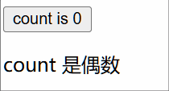

# [0010. 条件渲染](https://github.com/Tdahuyou/react/tree/main/0010.%20%E6%9D%A1%E4%BB%B6%E6%B8%B2%E6%9F%93)

<!-- region:toc -->
- [1. 🔍 查看 react 官方文档关于 Conditional rendering 条件渲染的说明](#1--查看-react-官方文档关于-conditional-rendering-条件渲染的说明)
- [2. 💻 demos.1 - 条件渲染示例](#2--demos1---条件渲染示例)
- [3. 📒 对比 vue 中的 v-if 和 v-show](#3--对比-vue-中的-v-if-和-v-show)
<!-- endregion:toc -->
- 类似于 vue 中的 v-show、v-if，不过在 react 中，条件渲染是通过纯 js 结合 jsx 语法来实现的，更加的灵活。
- React 中没有类似 vue 中的 v-if、v-else、v-show 的条件渲染指令，React 中的条件渲染是通过在 JSX 使用原始的 JavaScript 条件逻辑来决定要渲染什么内容的，写起来更加原生，更加直观、更加灵活。

## 1. 🔍 查看 react 官方文档关于 Conditional rendering 条件渲染的说明

- https://zh-hans.react.dev/learn#conditional-rendering
- React 没有特殊的语法来编写条件语句，因此你使用的就是普通的 JavaScript 代码。例如使用 if 语句根据条件引入 JSX：

```jsx
let content;
if (isLoggedIn) {
  content = <AdminPanel />;
} else {
  content = <LoginForm />;
}
return (
  <div>
    {content}
  </div>
);
```

- 如果你喜欢更为紧凑的代码，可以使用 [条件 ? 运算符](https://developer.mozilla.org/zh-CN/docs/Web/JavaScript/Reference/Operators/Conditional_operator)。与 if 不同的是，它工作于 JSX 内部：

```jsx
<div>
  {isLoggedIn ? (
    <AdminPanel />
  ) : (
    <LoginForm />
  )}
</div>
```

- 当你不需要 else 分支时，你也可以使用更简短的 [逻辑 && 语法](https://developer.mozilla.org/zh-CN/docs/Web/JavaScript/Reference/Operators/Logical_AND#short-circuit_evaluation)：

```jsx
<div>
  {isLoggedIn && <AdminPanel />}
</div>
```

- 所有这些方法也适用于有条件地指定属性。如果你对 JavaScript 语法不熟悉，你可以先使用 if...else。

## 2. 💻 demos.1 - 条件渲染示例

```jsx
import { StrictMode } from 'react'
import { createRoot } from 'react-dom/client'
import { useState } from 'react'

function App() {
  const [count, setCount] = useState(0)

  return (
    <>
      <p>
        <button onClick={() => setCount((count) => count + 1)}>
          count is {count}
        </button>
      </p>
      {/* 测试 - 条件渲染 - 根据当前 count 的值来决定渲染不同的内容 */}
      <div>
        { count % 2 === 0 ? <div>count 是偶数</div> : <div>count 是奇数</div> }
      </div>
    </>
  )
}

createRoot(document.getElementById('root')).render(
  <StrictMode>
    <App />
  </StrictMode>,
)
```

- 

## 3. 📒 对比 vue 中的 v-if 和 v-show

- 在 vue 中，有俩内置指令来控制元素的显示、隐藏。
  - v-if
  - v-show
  - v-if、v-show 是用来做条件渲染用的，当条件满足时才会渲染对应的内容。
- 在 react 中，并不存在类似的概念，由于 react 中的组件模板（html 标签）是通过 JSX 语法，直接跟 js 写在一起的，并不像 vue 那样，将 template 和 script 分离，所以在 react 中，对于条件渲染的处理逻辑会更加灵活，走 js 那套就行，无论是使用 if 语句还是三木运算符还是逻辑短路的写法，都是 ok 的。

