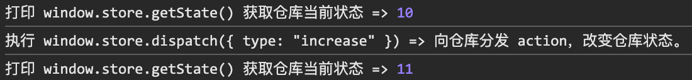
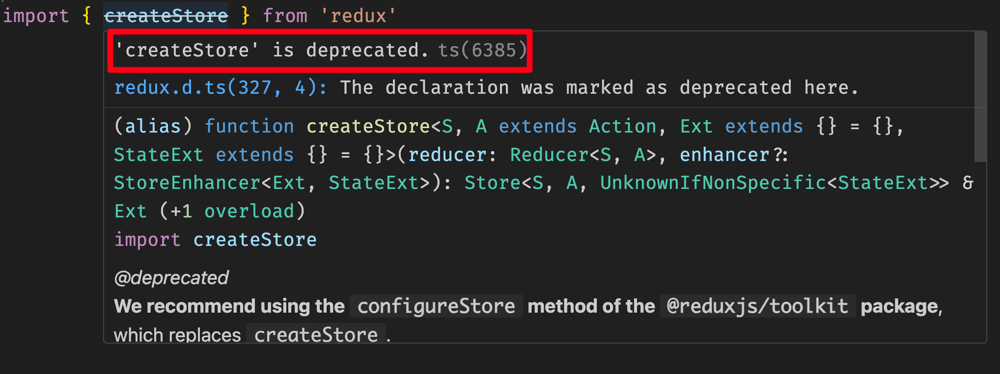
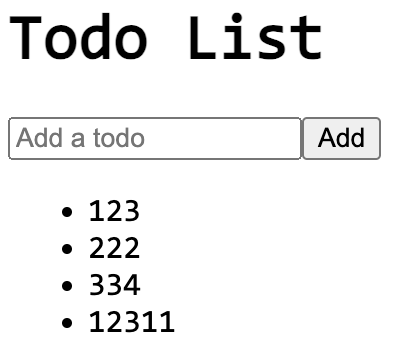

# [0028. redux 的基本使用](https://github.com/Tdahuyou/react/tree/main/0028.%20redux%20%E7%9A%84%E5%9F%BA%E6%9C%AC%E4%BD%BF%E7%94%A8)

<!-- region:toc -->
- [1. 📒 本节会用到的一些依赖](#1--本节会用到的一些依赖)
- [2. 💻 demos.1 - 脱离 react 单独使用 redux 来管理状态数据](#2--demos1---脱离-react-单独使用-redux-来管理状态数据)
- [3. 💻 demos.2 - redux 的基本使用 - createStore 版](#3--demos2---redux-的基本使用---createstore-版)
- [4. 💻 demos.2 - redux 的基本使用 - @reduxjs/toolkit 版](#4--demos2---redux-的基本使用---reduxjstoolkit-版)
- [5. 💻 demos.2 - redux 的基本使用 - @reduxjs/toolkit 版（模块化）](#5--demos2---redux-的基本使用---reduxjstoolkit-版模块化)
<!-- endregion:toc -->

## 1. 📒 本节会用到的一些依赖

```bash
npm install redux react-redux @reduxjs/toolkit
```

## 2. 💻 demos.1 - 脱离 react 单独使用 redux 来管理状态数据

```js
/**
 * main.js
 *
 * 这是使用 vite 搭建的一个 Vanilla 原始工程。
 * 没有依赖任何第三方框架，只使用了原生的 JavaScript。
 * 然后通过 pnpm i redux 来了解 redux 的基本使用。
 *
 * redux 和 react 没有直接关联，完全可以脱离 react 单独 redux 来管理状态数据。
 * 从输出结果来看，会发现 redux 依旧是可以正常工作的。
 */
import * as redux from 'redux'

function countReducer(state, action) {
  if (action.type === 'increase') {
    return state + 1
  } else if (action.type === 'decrease') {
    return state - 1
  }
  return state
}

// 存到 window 对象上，以便测试
window.store = redux.createStore(countReducer, 10) // for test

const action = {
  type: 'increase',
}

console.log('打印 window.store.getState() 获取仓库当前状态 =>', window.store.getState())

console.log('执行 window.store.dispatch({ type: "increase" }) => 向仓库分发 action，改变仓库状态。')
window.store.dispatch(action)

console.log('打印 window.store.getState() 获取仓库当前状态 =>', window.store.getState())
```

- 最终输出结果：
  - 

## 3. 💻 demos.2 - redux 的基本使用 - createStore 版

```javascript
/**
 * src/App.jsx
 *
 * 仓库：
 * 假设仓库中仅存放了一个数字，该数字的变化可能是 +1 或 -1
 *
 *
 * action：
 * action 是一个用于描述需要做什么处理的普通对象。
 * 约定 action 的常见格式：{ type: "操作类型", payload: 附加数据 }
 * type 表示需要做啥事儿
 * payload 表示携带的参数
 *
 *
 * action 的创建：
 * action 可以像是这个 demo 中的写法，自己手写 action 的字面量。
 * const increaseAction = { type: 'increase' }
 * const decreaseAction = { type: 'decrease' }
 *
 * 另外一种更加常见的做法是封装一个 action 的创建函数，每次调用 action 创建函数，就返回一个 action 对象。
 *
 *
 * reducer：
 * reducer 本质上就是一个普通纯函数
 * reducer 的作用是用来根据传入的参数（旧的 state 和当前的 action）来生成一个新的状态。
 *
 * 在创建仓库的时候，可以指定 state 的默认值，通过 createStore 的第二个参数来传入。
 * 另外一种指定默认值的方式是直接给 reducer 的参数传递默认值。比如：
 *
 * reducer(state = 10, action) {
 *   // ...
 * }
 *
 *
 * 仓库数据实现响应式：react-redux
 * 在 React 中，如果你想根据 Redux store 的状态变化实时渲染组件，你需要使用 react-redux 库中的 Provider 和 useSelector 或 connect。
 * 这将允许你的组件订阅 store 的变化，并且当 store 的状态更新时自动重新渲染。
 *
 * <Provider store={store}>
 *   <Counter />
 * </Provider>
 * 使用 Provider 来包裹你的应用，然后把创建好的 store 丢给它，这样就可以让你的应用中的任何组件都能够访问到 Redux store 仓库中的数据。
 *
 * const count = useSelector(state => state);
 * 在 Counter 组件中，使用 useSelector 来获取当前的计数值，并且每当计数发生变化时，该组件会自动重新渲染。
 *
 * const dispatch = useDispatch();
 * 使用 useDispatch 来创建一个 dispatch 函数，用于发送 actions 到 store。
 */
import { createStore } from 'redux'
import { Provider, useSelector, useDispatch } from 'react-redux'

// 定义 reducer 函数
function counterReducer(state, action) {
  switch (action.type) {
    case 'increase':
      return state + 1;
    case 'decrease':
      return state - 1;
    default:
      return state;
  }
}

const store = createStore(counterReducer, 10)

// test
window.store = store

// 定义 action
const increaseAction = { type: 'increase' }
const decreaseAction = { type: 'decrease' }

// console.log(store.getState()) // 得到仓库中当前的数据
// store.dispatch(increaseAction); // 向仓库分发 action
// console.log(store.getState()) // 得到仓库中当前的数据

function Counter() {
  const count = useSelector(state => state);
  const dispatch = useDispatch();

  return (
    <>
      <button onClick={() => dispatch(decreaseAction)}>-</button>
      <span>{count}</span>
      <button onClick={() => dispatch(increaseAction)}>+</button>
    </>
  );
}

// 根组件
function App() {
  return (
    <Provider store={store}>
      <Counter />
    </Provider>
  );
}

export default App
```

## 4. 💻 demos.2 - redux 的基本使用 - @reduxjs/toolkit 版

- 当你在程序中引入 createStore 的时候，会提示这玩意儿已经被废弃了。
  - 
- createStore 方法已经被标记为过时（deprecated），Redux 社区推荐使用新的方法来创建 store。就目前（2024年10月27日）来看，官方推荐使用 configureStore 方法，这是来自 @reduxjs/toolkit 包的一部分。

```jsx
/**
 * src/App.jsx
 */
import { configureStore, createSlice } from '@reduxjs/toolkit'
import { Provider, useSelector, useDispatch } from 'react-redux'

// 创建一个 slice，它包含了 reducer 逻辑和 actions
const todoSlice = createSlice({
  name: 'todos',
  initialState: {
    todos: [],
  },
  reducers: {
    addTodo: (state, action) => {
      state.todos.push({ id: Date.now(), text: action.payload })
    },
  },
})
const { addTodo } = todoSlice.actions

// 配置 store
const store = configureStore({
  reducer: {
    todos: todoSlice.reducer,
  },
})

// React 组件
function TodoList() {
  const todos = useSelector((state) => state.todos.todos) // 使用 useSelector 获取状态
  const dispatch = useDispatch() // 使用 useDispatch 分发 action

  return (
    <>
      <h1>Todo List</h1>
      <ul>
        {todos.map((todo) => (
          <li key={todo.id}>{todo.text}</li>
        ))}
      </ul>
      <button
        onClick={() => dispatch(addTodo('Learn Redux - ' + todos.length))}
      >
        Add Todo
      </button>
    </>
  )
}

function App() {
  return (
    <Provider store={store}>
      <TodoList />
    </Provider>
  )
}

export default App
```

## 5. 💻 demos.2 - redux 的基本使用 - @reduxjs/toolkit 版（模块化）

- 这个示例介绍在实际开发中，常见的规划模块（也就是 store、reducer 这些逻辑一般封装在啥位置）的一种做法。
- 最终效果
  - 

```jsx
/**
 * src/main.jsx
 */
import { StrictMode } from 'react'
import { createRoot } from 'react-dom/client'
import store from './store'
import { Provider } from 'react-redux'
import App from './App.jsx'

createRoot(document.getElementById('root')).render(
  <StrictMode>
    <Provider store={store}>
      <App />
    </Provider>
  </StrictMode>
)
```

```jsx
/**
 * src/App.jsx
 * 在 React 组件中使用 Redux
 */
import { useSelector, useDispatch } from 'react-redux'
import { addTodo } from './features/todos/todoSlice'
function App() {
  const todos = useSelector((state) => state.todos.todos)
  const dispatch = useDispatch()

  const handleAddTodo = (e) => {
    e.preventDefault()
    const input = e.target.elements.todoInput
    if (input.value.trim()) {
      dispatch(addTodo(input.value))
      input.value = ''
    }
  }

  return (
    <div>
      <h1>Todo List</h1>
      <form onSubmit={handleAddTodo}>
        <input type="text" name="todoInput" placeholder="Add a todo" />
        <button type="submit">Add</button>
      </form>
      <ul>
        {todos.map((todo) => (
          <li key={todo.id}>{todo.text}</li>
        ))}
      </ul>
    </div>
  )
}

export default App
```

```js
/**
 * src/store.js
 */
import { configureStore } from '@reduxjs/toolkit'

// 引入需要假如到 store 中的 reducer
import todoReducer from './features/todos/todoSlice'

const store = configureStore({
  reducer: {
    todos: todoReducer, // 注入 reducer，有多少个需要注入的就写多少个，后续若不需要的话，直接注释掉或者删掉即可。
  },
})
export default store
```

```js
/**
 * src/features/todos/todoSlice.js
 * 创建 Reducer 和 Slice
 * 模块化 - 和 todos 功能相关的 reducer 统一都丢到 src/features/todos 中进行管理。
 */
import { createSlice } from '@reduxjs/toolkit'

const initialState = {
  todos: [],
}

const todoSlice = createSlice({
  name: 'todos',
  initialState,
  reducers: {
    addTodo: (state, action) => {
      state.todos.push({ id: Date.now(), text: action.payload })
    },
  },
})

export const { addTodo } = todoSlice.actions
export default todoSlice.reducer
```

