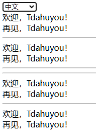

# [0038. react-intl](https://github.com/Tdahuyou/react/tree/main/0038.%20react-intl)

<!-- region:toc -->
- [1. 🔗 links](#1--links)
- [2. 📒 react-intl 简介](#2--react-intl-简介)
- [3. 🤔 ICU (International Components for Unicode) 是什么？有什么用？](#3--icu-international-components-for-unicode-是什么有什么用)
  - [3.1. ICU（International Components for Unicode）简介](#31-icuinternational-components-for-unicode简介)
  - [3.2. 核心功能](#32-核心功能)
  - [3.3. 国际化与本地化支持](#33-国际化与本地化支持)
  - [3.4. MessageFormat 功能](#34-messageformat-功能)
  - [3.5. 平台与兼容性](#35-平台与兼容性)
  - [3.6. 社区与维护](#36-社区与维护)
  - [3.7. 总结](#37-总结)
- [4. 💻 demos.1 - react-intl 基本使用](#4--demos1---react-intl-基本使用)
- [5. 🔍 如何判断传入的 locale 是否是合法值](#5--如何判断传入的-locale-是否是合法值)
- [6. 💻 demos.1 - 特殊的 locale 值](#6--demos1---特殊的-locale-值)
- [7. 💻 demos.1 - useIntl、injectIntl - 使用 defineMessages 定义消息](#7--demos1---useintlinjectintl---使用-definemessages-定义消息)
- [8. 💻 demos.1 - 通过 intl 对象来获取国际化消息数据](#8--demos1---通过-intl-对象来获取国际化消息数据)
- [9. 💻 demos.2 - IntlShape 在 .ts 中的应用](#9--demos2---intlshape-在-ts-中的应用)
<!-- endregion:toc -->
- React-Intl 是一个强大的工具，可帮助开发人员轻松管理和本地化他们的 React 应用程序。

## 1. 🔗 links

- https://formatjs.github.io/docs/getting-started/installation/
  - react-intl 官方文档
- https://formatjs.github.io/docs/core-concepts/icu-syntax/
  - react-intl 官方文档 - 核心概念 - Message Syntax
- https://icu.unicode.org/
  - ICU-TC Home Page
  - ICU (International Components for Unicode)
- https://unicode-org.github.io/icu/
  - ICU Documentation
- https://unicode-org.github.io/icu/userguide/format_parse/messages/
  - 用于查阅 ICU Message syntax

## 2. 📒 react-intl 简介

- React-Intl 是一个开源 JavaScript 库，用于在 React 应用程序中实现国际化。它提供了一组工具来处理应用程序中的本地化需求，包括日期、时间、货币和消息等。
- React-Intl 的主要功能之一是支持多语言翻译。它允许开发人员将应用程序的文本和消息存储在一个外部文件中，并使用相应的语言代码来加载正确的翻译版本。这使得开发人员可以轻松地为不同的语言环境创建本地化的应用程序，而无需手动编写每个字符串的翻译。
- 除了多语言翻译外，React-Intl 还提供了其他有用的特性，例如格式化日期和时间、货币转换以及自定义消息解析器。这些功能可以帮助开发人员更轻松地管理应用程序中的本地化需求，并确保它们正确地显示给用户。
- React-Intl 还与许多流行的前端框架（如 Next.js 和 Gatsby）集成良好，使其成为构建现代 Web 应用程序的理想选择。
- React-Intl 是基于 ICU 的国际化标准和功能构建的。
- Message Syntax
  - Message Syntax 是一种用于格式化消息的语法，它支持嵌入式的文本替换和格式化，并且可以处理不同语言的特殊规则。
  - 和 ICU Message Syntax 类似。
    - 比如，我们可以使用 Message Syntax 来创建一条包含日期和时间的消息。
      - `"当前时间：今天是 {ts, date, ::yyyy年M月d日 hh:mm:ss}"`
      - 其中的 `{ts, date, ::yyyy年M月d日 hh:mm:ss}` 就是一个 ICU Message Syntax 的格式，它表示一个日期格式，其中 `ts` 是一个占位符，表示日期和时间的值，`date` 是一个类型，表示一个日期，`::yyyy年M月d日 hh:mm:ss` 是一个格式，表示日期的格式。
    - 通过使用 `{key, type, format}` 格式，我们可以根据不同的条件选择输出不同的字符串，从而实现更灵活的消息显示方式。
- react-intl 库中的一些常用模块
  - **IntlProvider**
    - 这是一个高阶组件，用于为应用程序提供国际化（i18n）环境。
    - 它需要一个 `locale` 属性来指定语言环境，并且可以包含 `messages` 属性来提供翻译信息。
    - **IntlProvider 组件是用来提供数据的。**
  - **FormattedMessage**
    - 用于在 JSX 中插入已格式化的消息。
    - 通过 id 属性来指定使用 IntlProvider 提供的 messages 中的哪条消息。
    - 通过 values 属性来提供消息的参数。
  - **defineMessages**
    - 用于定义多个消息对象，通常在一个单独的文件中定义并导出，以便集中管理所有的国际化消息。
    - 在 node_modules/react-intl/index.js 中可以查看到 defineMessages 的实现源码：
      - `function defineMessages(msgs) { return msgs; }`
      - 源代码非常简单，就是将传入的 `msgs` 对象直接返回，没有做任何处理。
  - **injectIntl**
    - 这是一个高阶组件，用于将 `intl` 对象注入到组件的 props 中。这使得组件可以直接访问 `intl` 提供的方法和属性。
    - 在导出组件 `MyComponent` 的时候，使用 `injectIntl` 高阶组件包裹一下 `export default injectIntl(MyComponent);`，这会将 `intl` 对象注入到组件的 props 中。
  - **IntlShape**、**intlShape**
    - 定义了 `intl` 对象的形状（shape），通常用于类型检查或 prop 类型验证，确保传递给组件的 `intl` 对象符合预期结构。
    - `MyComponent.propTypes = { intl: intlShape.isRequired };`
    - `intlShape` 是一个相对早期（比如 v2.x）的 API，在当前（2025年1月3日13:27:11）的最新版 `"react-intl": "^7.1.0"` 中，这玩意儿已经被移除了。如果是 ts 项目，可以导入 `IntlShape` 类型。
    - ⚠️ 注意：`intlShape` 已经被废弃，和目前很多库的版本不兼容，使用它会有不少坑。

## 3. 🤔 ICU (International Components for Unicode) 是什么？有什么用？

### 3.1. ICU（International Components for Unicode）简介

ICU 是一个功能强大、跨平台的 C/C++ 和 Java 库，专为国际化（i18n）和本地化（l10n）开发设计。它提供了一整套工具，帮助软件开发者处理全球化的语言和地区需求。

### 3.2. 核心功能

1. **文本处理与字符集转换**
   - 支持 Unicode 字符编码和字符串操作。
   - 提供从一种字符集到另一种字符集的高效转换。
2. **格式化**
   - **数字和货币**：根据地区规范格式化数字和货币。
   - **日期与时间**：支持全球多种日历系统（如公历、农历、伊斯兰历）和地区特定的日期格式。
   - **消息模板**：使用动态、多语言的消息模板生成符合用户语言环境的内容。
3. **排序与查找**
   - 基于 Unicode 排序规则 (Collation) 进行多语言文本排序。
   - 支持全文搜索、子串匹配和文本比较等操作，确保语言环境敏感性。

### 3.3. 国际化与本地化支持

- **适配多语言环境：** 提供工具帮助开发者轻松适配全球各地的语言、文化和地区规范。
- **全球化支持：** 包括语言方向（如从右到左的阿拉伯文）和复杂脚本（如印度语和泰语）。

### 3.4. MessageFormat 功能

ICU 提供了强大的 **MessageFormat**，允许开发者动态生成语言环境敏感的文本。例如：

```java
MessageFormat msgFmt = new MessageFormat(
    "在 {0,number} 小时后，任务将完成", Locale.CHINESE);
String result = msgFmt.format(new Object[] { 5 });
System.out.println(result);
// 输出：在 5 小时后，任务将完成
```

它支持变量插值、性别/复数处理（如“1 item” vs “2 items”）和条件逻辑，使得创建动态、多语言内容变得简单高效。

### 3.5. 平台与兼容性

- **跨平台支持：** ICU 可运行在多种操作系统（Windows、Linux、macOS）上。
- **多语言接口：** 提供 C/C++ 和 Java 的核心实现，并扩展到其他语言（如 Python 和 .NET）。

### 3.6. 社区与维护

- ICU 由 Unicode 联盟维护，并拥有一个全球开发者社区。
- 定期更新以确保与 Unicode 标准和地区规范保持一致。
- 广泛应用于现代软件（如浏览器、操作系统和数据库）中，具有极高的稳定性和可靠性。

### 3.7. 总结

ICU 是现代软件开发中不可或缺的国际化工具，它的功能涵盖文本处理、格式化、排序和多语言支持，为开发者解决了语言和地区适配的复杂问题。在需要支持全球化用户的项目中，ICU 是最佳选择之一。


## 4. 💻 demos.1 - react-intl 基本使用

```js
import { StrictMode, useState, useEffect } from 'react';
import { createRoot } from 'react-dom/client';

import { IntlProvider, FormattedMessage, FormattedNumber } from 'react-intl';

// 系统需要支持哪些语言
const LOCALE_TYPE = {
  ZH_CN: 'zh-cn',
  EN: 'en',
}

// 系统中用到的所有文本内容，都可以统一配置到一个 messages 模块中。
// 在 key 的命名上，可以根据页面来对文本做分组，以便管理和查阅。
const messages = {
  [LOCALE_TYPE.ZH_CN]: {
    "page1.xxx.xxx.currentTime": "当前时间：今天是 {ts, date, ::yyyy年M月d日 hh:mm:ss}",
    "page2.xxx.xxx.currency": "人民币：",
  },
  [LOCALE_TYPE.EN]: {
    "page1.xxx.xxx.currentTime": "Current Time: Today is {ts, date, ::MMMM d, yyyy hh:mm:ss}",
    "page2.xxx.xxx.currency": "USD: ",
  }
}

const getCurrencyCode = (locale) => locale === LOCALE_TYPE.ZH_CN ? "CNY" : "USD";

function App() {
  const [locale, setLocale] = useState(LOCALE_TYPE.ZH_CN);
  const [currentDate, setCurrentDate] = useState(new Date());

  useEffect(() => {
    const timer = setInterval(() => {
      setCurrentDate(new Date());
    }, 1000);
    return () => clearInterval(timer);
  }, []);

  return (
    <IntlProvider messages={messages[locale]} locale={locale} defaultLocale={LOCALE_TYPE.EN}>
      <div>
        <select value={locale} onChange={(e) => setLocale(e.target.value)}>
          <option value={LOCALE_TYPE.ZH_CN}>中文</option>
          <option value={LOCALE_TYPE.EN}>English</option>
        </select>
        <p>
          <FormattedMessage id="page1.xxx.xxx.currentTime" values={{ ts: currentDate }} description="页面 1 中的 xxx 的 xxx 的系统当前时间" />
          <br />
          <FormattedMessage id="page2.xxx.xxx.currency" description="页面 2 中的 xxx 的 xxx 的金额标签" />
          <FormattedNumber value={19} style="currency" currency={getCurrencyCode(locale)} description="页面 2 中的 xxx 的 xxx 的金额" />
        </p>
      </div>
    </IntlProvider>
  );
}

createRoot(document.getElementById('root')).render(
  <StrictMode>
    <App />
  </StrictMode>,
);
```

- 最终渲染结果：
  - 中文：
    - 
  - 英文：
    - 
- IntlProvider - 用于提供消息数据。
  - messages
    - messages 属性绑定系统消息数据，以供 `<Formatted*>` 组件通过 id 来访问这些数据。
    - 这里提到的 id 其实就是 messages 对象的 key。
  - locale
    - 用于指定当前应用使用的语言环境，它是一个必须的字段，如果不填，则默认为 `'en'`。
    - locale 的数据类型是一个字符串，但是不能是随意的值，必须能够通过 `Intl.NumberFormat.supportedLocalesOf(locale)` 函数检测。
    - 对于 locale，常见的一些标准值都是合法的，比如 zh、zh-cn、zh-CN、en、de、ko、ja 等等。在不确定自己写的值是否支持，可以先通过 `Intl.NumberFormat.supportedLocalesOf(locale)` 函数来检测一下。
  - defaultLocale
    - defaultLocale 用于修改 locale 的默认值，会自动使用 defaultLocale。
    - 值得注意的是 - 如果 locale 不合法，程序会直接报错，而非使用 defaultLocale。
- FormattedMessage、FormattedNumber - 用于格式化消息数据，让数据展示格式具备国际化需求。
  - 它们是用于格式化消息的组件。
  - description 属性
    - 用于描述这个消息是啥玩意儿，这可以根据咱们的理解随便书写。
  - FormattedMessage 的 id
    - 用于标识使用什么字符串来占位。
  - FormattedMessage 的 values
    - 用于给消息中的占位符变量传递数据。
    - 比如 {ts, date, ::yyyy年M月d日 hh:mm:ss}，这里的 ts 就是占位符。
    - date 是 ICU 的一个格式化类型，它表示一个日期。（除了 date，还有 number、time 等等）
      - docs：https://formatjs.github.io/docs/core-concepts/icu-syntax/
    - 最后一部分 `::yyyy年M月d日 hh:mm:ss` 用于指定日期的格式。
    - 上述这种结构 `{key, type, format}` 是通用的，其中 key 是必填的，其他的都是根据需求可选的。
  - `Formatted*` 有很多，比如这里的 FormattedNumber
    - docs：https://formatjs.github.io/docs/intl/
    - 小结：其实用一个 FormattedMessage 基本就够了，其他的 `Formatted*` 都可以基于 `FormattedMessage` 来实现，如果有一些简单的格式化的逻辑需求，完全可以自己实现。

## 5. 🔍 如何判断传入的 locale 是否是合法值

- https://github.com/formatjs/formatjs/blob/%40formatjs/intl%403.0.4/packages/intl/src/create-intl.ts#L77
- @formatjs/intl@3.0.4/packages/intl/src/create-intl.ts 源码

```js
const locale = 'xxx'
if (!Intl.NumberFormat.supportedLocalesOf(locale).length) {
    console.log(locale, '不支持')
}
// 🔗 MDN Intl => doc: https://developer.mozilla.org/zh-CN/docs/Web/JavaScript/Reference/Global_Objects/Intl


// locale 不是一个随意的字符串，如果传入非法值是会报错的，比如
Intl.NumberFormat.supportedLocalesOf('Tdahuyou&We')
// ❌
// Uncaught RangeError: Incorrect locale information provided
//     at Function.supportedLocalesOf (<anonymous>)
//     at <anonymous>:1:19

// 至于什么值是合法的，什么值是非法的，MDN 上提到 locale 必须是一个  BCP 47 语言标记的字符串。
// 🔗 BCP 47 语言标记 => https://datatracker.ietf.org/doc/html/rfc5646
// 文章尚未仔细读过。
// 通过简单的自测，感觉合法的 locale 蛮奇怪的，常见的一些标准值都是合法的，比如 zh、zh-cn、zh-CN、en、de、ko、ja 等等。
// 同时，locale 可以是一些奇怪的值，比如 zh-250102
// 下面是简单自测的结果：
Intl.NumberFormat.supportedLocalesOf('zh') // => ['zh']
Intl.NumberFormat.supportedLocalesOf('zh-cn') // => ['zh-CN']
Intl.NumberFormat.supportedLocalesOf('zh-CN') // => ['zh-CN']
Intl.NumberFormat.supportedLocalesOf('en') // => ['en']
Intl.NumberFormat.supportedLocalesOf('de') // => ['de']
Intl.NumberFormat.supportedLocalesOf('ko') // => ['ko']
Intl.NumberFormat.supportedLocalesOf('ja') // => ['ja']

Intl.NumberFormat.supportedLocalesOf('zh-250102') // => ['zh-250102']
```

## 6. 💻 demos.1 - 特殊的 locale 值

```js
import { StrictMode, useState } from 'react';
import { createRoot } from 'react-dom/client';

import { IntlProvider, FormattedMessage, FormattedDate } from 'react-intl';

const LOCALE_TYPE = {
  ZH_CN: 'zh-250102',
  EN: 'en',
}

const messages = {
  [LOCALE_TYPE.ZH_CN]: {
    "currentTime": "今天是 {date}",
  },
  [LOCALE_TYPE.EN]: {
    "currentTime": "Today is {date}",
  }
}

function App() {
  const [_locale, setL] = useState(LOCALE_TYPE.ZH_CN);

  return (
    <IntlProvider messages={messages[_locale]} locale={_locale} defaultLocale={LOCALE_TYPE.EN}>
      <div>
        <select value={_locale} onChange={(e) => setL(e.target.value)}>
          <option value={LOCALE_TYPE.ZH_CN}>中文</option>
          <option value={LOCALE_TYPE.EN}>English</option>
        </select>
        <p>
          <FormattedMessage id="currentTime" values={{ date: <FormattedDate value={new Date()} /> }} />
        </p>
      </div>
    </IntlProvider>
  );
}

createRoot(document.getElementById('root')).render(
  <StrictMode>
    <App />
  </StrictMode>,
);
```

## 7. 💻 demos.1 - useIntl、injectIntl - 使用 defineMessages 定义消息

```js
import React, { StrictMode, useState, useEffect } from 'react';
import { createRoot } from 'react-dom/client';
import { IntlProvider, FormattedMessage, defineMessages, useIntl } from 'react-intl';

// 推荐
const msg = defineMessages({
  welcome: {
    id: 'app.welcome',
    defaultMessage: 'Welcome, {name}!',
    description: '欢迎用户的消息',
  },
  goodbye: {
    id: 'app.goodbye',
    defaultMessage: 'Goodbye, {name}!',
    description: '告别用户的消息',
  },
});

// 不推荐
const msg2 = {
  welcome: {
    id: 'app.welcome',
    defaultMessage: 'Welcome, {name}!',
    description: '欢迎用户的消息',
  },
  goodbye: {
    id: 'app.goodbye',
    defaultMessage: 'Goodbye, {name}!',
    description: '告别用户的消息',
  },
};

function Greeting({ name }) {
  const intl = useIntl();
  return (
    <>
      {/* 在组件中使用 */}
      <div>
        <FormattedMessage {...msg.welcome} values={{ name }} />
        <br />
        <FormattedMessage {...msg.goodbye} values={{ name }} />
      </div>
      <hr />
      <div>
        <FormattedMessage {...msg2.welcome} values={{ name }} />
        <br />
        <FormattedMessage {...msg2.goodbye} values={{ name }} />
      </div>
      <hr />
      <hr />
      {/* 在函数中使用 */}
      <div>
        {intl.formatMessage(msg.welcome, { name })}
        <br />
        {intl.formatMessage(msg.goodbye, { name })}
      </div>
      <hr />
      <div>
        {intl.formatMessage(msg2.welcome, { name })}
        <br />
        {intl.formatMessage(msg2.goodbye, { name })}
      </div>
    </>
  );
}

// -------------------------------------------------------------------------
// #region Q&A
// -------------------------------------------------------------------------
// 🤔 msg、msg2 有何区别？
// 答：单从 demo 的功能来看，用哪个其实都 ok，没啥区别。

// 🔍 在 node_modules/react-intl/index.js 中可以查看到 defineMessages 的实现源码：
// function defineMessages(msgs) {
//   return msgs;
// }
// 会发现它其实就是将传入的对象直接返回，并没有做任何的特殊处理。
// 不过还是推荐使用 defineMessages 来定义消息。
// 1. 可以获得更好的 IDE 支持，比如快速跳转到对应的类型声明文件查看消息结构信息。
//    export interface MessageDescriptor {
//        id?: MessageIds;
//        description?: string | object;
//        defaultMessage?: string | MessageFormatElement[];
//    }
// 2. 如果使用的是 .ts 来写，还能获取更友好的类型提示。
// 3. 工具链支持，配套的 react-intl-cli 库在处理的时候，可以自动扫描并提取 defineMessages 定义的消息到翻译文件中，若使用 msg2 的写法，则无法提取。
// 4. 可读性相对更好一些。
// -------------------------------------------------------------------------
// #endregion Q&A
// -------------------------------------------------------------------------


// 包含了所有的翻译信息的模块
const localeMessages = {
  en: {
    'app.welcome': 'Welcome, {name}!',
    'app.goodbye': 'Goodbye, {name}!',
  },
  zh: {
    'app.welcome': '欢迎，{name}！',
    'app.goodbye': '再见，{name}！',
  },
};

function App() {
  const [locale, setLocale] = useState('en'); // 可以根据需要动态设置
  const messages = localeMessages[locale];

  return (
    <IntlProvider locale={locale} messages={messages}>
      <div>
        <select value={locale} onChange={(e) => setLocale(e.target.value)}>
          <option value="en">English</option>
          <option value="zh">中文</option>
        </select>
        <Greeting name="Tdahuyou" />
      </div>
    </IntlProvider>
  );
}

createRoot(document.getElementById('root')).render(
  <StrictMode>
    <App />
  </StrictMode>,
);
```

- 
- 

## 8. 💻 demos.1 - 通过 intl 对象来获取国际化消息数据

```js
import React, { StrictMode, useState } from 'react';
import { createRoot } from 'react-dom/client';
import { IntlProvider, defineMessages, useIntl, injectIntl } from 'react-intl';

const msg = defineMessages({
  welcome: {
    id: 'app.welcome',
    defaultMessage: 'Welcome, {name}!',
    description: '欢迎用户的消息',
  },
  goodbye: {
    id: 'app.goodbye',
    defaultMessage: 'Goodbye, {name}!',
    description: '告别用户的消息',
  },
});

function Greeting({ name, intl }) {
  // 通过 useIntl(); 来获取 intl 对象
  const intl2 = useIntl();

  // 通过 injectIntl 和 useIntl() 获取到的 intl 是同一个对象。
  // console.log(intl === intl2); // true

  return (
    <>
      <div>
        {intl2.formatMessage(msg.welcome, { name })}
        <br />
        {intl2.formatMessage(msg.goodbye, { name })}
      </div>
      <hr />
      <div>
        {intl.formatMessage(msg.welcome, { name })}
        <br />
        {intl.formatMessage(msg.goodbye, { name })}
      </div>
    </>
  );
}

const localeMessages = {
  en: {
    'app.welcome': 'Welcome, {name}!',
    'app.goodbye': 'Goodbye, {name}!',
  },
  zh: {
    'app.welcome': '欢迎，{name}！',
    'app.goodbye': '再见，{name}！',
  },
};

function App() {
  const [locale, setLocale] = useState('en');
  const messages = localeMessages[locale];

  const GreetingContainer = injectIntl(Greeting); // 注入 intl 对象

  return (
    <IntlProvider locale={locale} messages={messages}>
      <div>
        <select value={locale} onChange={(e) => setLocale(e.target.value)}>
          <option value="en">English</option>
          <option value="zh">中文</option>
        </select>
        <GreetingContainer name="Tdahuyou" />
      </div>
    </IntlProvider>
  );
}

createRoot(document.getElementById('root')).render(
  <StrictMode>
    <App />
  </StrictMode>,
);
```

- 
- 

## 9. 💻 demos.2 - IntlShape 在 .ts 中的应用

```ts
import { StrictMode, useState } from 'react';
import { createRoot } from 'react-dom/client';
import { IntlProvider, defineMessages, useIntl, injectIntl, IntlShape } from 'react-intl';

const msg = defineMessages({
  welcome: {
    id: 'app.welcome',
    defaultMessage: 'Welcome, {name}!',
    description: '欢迎用户的消息',
  },
  goodbye: {
    id: 'app.goodbye',
    defaultMessage: 'Goodbye, {name}!',
    description: '告别用户的消息',
  },
});

interface GreetingProps {
  name: string;
  intl: IntlShape;
}

function Greeting({ name, intl }: GreetingProps) {
  const intl2: IntlShape = useIntl();

  // 通过 injectIntl 和 useIntl() 获取到的 intl 是同一个对象。
  // console.log(intl === intl2); // true

  return (
    <>
      <div>
        {intl2.formatMessage(msg.welcome, { name })}
        <br />
        {intl2.formatMessage(msg.goodbye, { name })}
      </div>
      <hr />
      <div>
        {intl.formatMessage(msg.welcome, { name })}
        <br />
        {intl.formatMessage(msg.goodbye, { name })}
      </div>
    </>
  );
}

const localeMessages = {
  en: {
    'app.welcome': 'Welcome, {name}!',
    'app.goodbye': 'Goodbye, {name}!',
  },
  zh: {
    'app.welcome': '欢迎，{name}！',
    'app.goodbye': '再见，{name}！',
  },
};

type Locale = keyof typeof localeMessages;

function App() {
  const [locale, setLocale] = useState<Locale>('en');
  const messages = localeMessages[locale];

  const GreetingContainer = injectIntl(Greeting); // 注入 intl 对象

  return (
    <IntlProvider locale={locale} messages={messages}>
      <div>
        <select value={locale} onChange={(e) => setLocale(e.target.value as Locale)}>
          <option value="en">English</option>
          <option value="zh">中文</option>
        </select>
        <GreetingContainer name="Tdahuyou" />
      </div>
    </IntlProvider>
  );
}

createRoot(document.getElementById('root')!).render(
  <StrictMode>
    <App />
  </StrictMode>,
);
```

- 
- 

